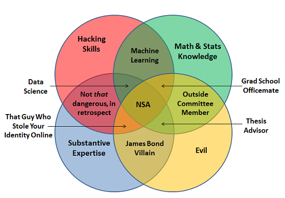

```{r setup, include=FALSE}
options(htmltools.dir.version = FALSE)
knitr::opts_chunk$set(echo=FALSE, warning=FALSE, message=FALSE,
                      out.width = "90%", fig.align = "center")
```

class: class: center, middle

# Faxineiro de dados

```{r}
knitr::include_graphics("imgs/jtrecenti.png")
```

---
class: center, middle

```{r}
knitr::include_graphics("imgs/cursor.png")
```

---
class: middle, center

### Provocação

```{r warning=FALSE, message=FALSE, fig.width=10, fig.height=6, out.width="80%"}
library(tidyverse)
p <- tibble::tribble(
   ~ano, ~vagas_br, ~form_bra, ~form_eua,
  2004L,1334L,407L,544L,
  2005L,1356L,456L,603L,
  2006L,1296L,474L,606L,
  2007L,1429L,469L,610L,
  2008L,1766L,440L,715L,
  2009L,1673L,404L,747L,
  2010L,1836L,471L,849L,
  2011L,1972L,459L,1078L,
  2012L,1954L,425L,1345L,
  2013L,1798L,448L,1656L,
  2014L,1787L,386L,1937L,
  2015L,1789L,453L,2305L,
  2016L,1817L,364L,2758L
) %>% 
  select(-vagas_br) %>% 
  gather(tipo_form, form, starts_with("form")) %>% 
  mutate(tipo_form = if_else(tipo_form == "form_bra", "Brasil", "EUA")) %>% 
  ggplot(aes(x = ano, y = form, colour = tipo_form)) + 
  geom_line(size = 2) +
  geom_point(size = 3) +
  scale_colour_viridis_d(begin = 0.4, end = 0.8) +
  scale_y_continuous(breaks = 500 * 0:10) +
  theme_minimal(16) +
  labs(colour = "País",
       x = "Ano", y = "Formandos",
       title = "Quantidade de formandos em estatística",
       caption = "Fonte: INEP e ASA") +
  theme(legend.position = "bottom")
p
```

--

### R7: Mercado procura por cientistas de dados e promete salários de mais de R$ 20 mil

[http://bit.ly/r7-ds](http://bit.ly/r7-ds)

---

## Novos tempos?

- Nos últimos anos os tipos de dados mudaram.
- Coisas muito importantes no mercado hoje em dia:

```{r echo=FALSE, out.width="23%", fig.align='default'}
knitr::include_graphics(c("imgs/friends.jpg", "imgs/acordao.png", "imgs/wave.png"))
```

---

## Deep Learning

- Popularidade recente da área de deep learning.

- Promete fazer muitas coisas.

- Tem um linguajar diferente do que estamos acostumados.

```{r echo=FALSE, out.width='70%'}
knitr::include_graphics("imgs/deepl.png")
```

---

## Problemas

- Muita, muita gente usando.

--

- Mercado está pedindo. Só se fala nisso.

--

- Não aprendemos nada disso na faculdade

--

- O que estudamos é ultrapassado?

---
class: inverse, middle, center

# Depressão

---

## Marketing e diagramas de venn

```{r}
knitr::include_graphics("imgs/diff.png")
```

---

## Marketing e diagramas de venn

```{r, out.width="80%"}
knitr::include_graphics("imgs/dsvenn1.png")
```

---

## Marketing e diagramas de venn

```{r}

```

---

## Marketing e diagramas de venn

```{r, out.width="80%"}
knitr::include_graphics("imgs/dsvenn3.png")
```


---

## Depressão

```{r}
knitr::include_graphics("imgs/quit.png")
```

---

## Depressão 2

```{r}
knitr::include_graphics("imgs/dead.png")
```

---
class:inverse

## Não entre em pânico!

```{r, out.width="70%"}
knitr::include_graphics("imgs/panic.jpg")
```

---

## Não entre em pânico!

- Mais importante do que **definir** ciência de dados é **fazer** ciência de dados

```{r}
knitr::include_graphics("imgs/data-science.png")
```

--

- Existem muitos falsos cognatos.

--

- A maioria das coisas que estudamos é útil.

--

- Ainda assim, vale à pena estudar os conceitos.

--

## QUESTIONE

---

## Regressão logística

```{r}
knitr::include_graphics("imgs/glm.png")
```

---

## Função Deviance

$$
D(y,\hat\mu(x)) = \sum_{i=1}^n 2\left[y_i\log\frac{y_i}{\hat\mu_i(x_i)} + (1-y_i)\log\left(\frac{1-y_i}{1-\hat\mu_i(x_i)}\right)\right]
$$

$$
= 2 D_{KL}\left(y||\hat\mu(x)\right),
$$

onde $D_{KL}(p||q) = \sum_i p_i\log\frac{p_i}{q_i}$ é a divergência de Kullback-Leibler.

---

## Deep learning

```{r echo=FALSE, out.width='100%'}
knitr::include_graphics("imgs/y1.png")
```


- Faz uma combinação linear inputs $x$, adiciona um viés (*bias*) e depois aplica uma função de ativação não linear.

$$f(x) = \sigma(wx + b)$$

- Coincidência?

---

## Função de custo

$$
D_{KL}(p(x)||q(x))
$$

Conclusão: rede neural com uma camada é equivalente à regressão logística.

```{r, out.width="20%", fig.align="center"}
knitr::include_graphics("imgs/thinking.png")
```


--

## Dúvidas

- Se é a mesma coisa, por que está ganhando tanta popularidade?

- Devo estudar deep learning ou posso continuar fazendo regressão logística?

---
class: inverse, center, middle

# Qual é o meu papel?

---
class: center, middle

# Somos os líderes da ciência de dados!

---

## Onde estamos

```{r}
knitr::include_graphics("imgs/img01.png")
```

---

## Ciência de dados

```{r}
knitr::include_graphics("imgs/img02.png")
```

---
class: center, middle

# O que queremos?

---

## Aumentar registros

```{r, fig.height=6}
knitr::include_graphics("imgs/img03.png")
```

---

## Mais formados, menos evasão

```{r}
knitr::include_graphics("imgs/img04.png")
```

---

## Trazer os cientistas de dados

```{r}
knitr::include_graphics("imgs/img05.png")
```

---
class: inverse, center, middle

# O que devemos fazer?

---

# O que você quer?

--

## APRENDER (A)

- Saber muitas coisas, escrever artigos, pôr sua curiosidade em prática

--

## RESOLVER (R)

- Ganhar dinheiro, fazer sua empresa crescer, construir uma família

--

## PARTILHAR (P)

- Divulgar a profissão, ser relevante nas redes, ajudar a comunidade

---

# Focos

--
## 1. [APR] Faça parte e monte comunidades

--
## 2. [PAR] Seja relevante na web

--
## 3. [ARP] Estude, aprenda, atualize, use R

--
## 4. [RPA] Aproveite a universidade

--
## 5. [RAP] Apareça na universidade

---
class: inverse, middle

# E o conselho?

---

# O que estamos fazendo?

## Fiscalização

- Pesquisas Eleitorais

--

## Comunicação

- **Inbound**: Fazer os estatísticos procurarem o CONRE
- **Outbound**: Levar o CONRE aos estatísticos

--

## Próximos passos

---

# Fiscalização: pesqEle

- http://pesqele.conre3.org.br/app/

```{r}
knitr::include_graphics("imgs/pesqele.png")
```

---

# Comunicação: atividades

- Coleta de dados de formandos
- Funil de comunicação
- Visitas nas universidades
- Resolução 325

```{r, out.width="50%"}
knitr::include_graphics("imgs/carteirinha.jpg")
```

---
class: inverse, middle

# Próximos passos

---

# Faculdades de ciência de dados

- Graduação: Já existe! Izabela Hendrix

--

- Pós-Graduação: Diversos cursos de pós, MBA e especialização

--

- Cursos online de altíssima qualidade

--

- Departamentos de estatística integrando com computação e mudando de nome

--

- Expectativa: departamentos de ciência de dados serão mais comuns do que estatística até 2030.

--

## Solução...?

- Graduados em ciência de dados devem se registrar no Conselho.
- [2020] Criar certificação forte em ciência de dados pelo Conselho?

---

# Me stalkeia

- CONRE-3: [jtrecenti@conre3.org.br](mailto:jtrecenti@conre3.org.br)
- Curso-R: [jtrecenti@curso-r.com](mailto:jtrecenti@curso-r.com)
- ABJ: [jtrecenti@abj.org.br](mailto:jtrecenti@abj.org.br)
- Platipus: [jtrecenti@platipus.com.br](mailto:jtrecenti@platipus.com.br)

## Páginas: 

- https://curso-r.com
- https://abj.org.br
- https://github.com/jtrecenti

Apresentação: https://jtrecenti.github.io/slides/amostra/
