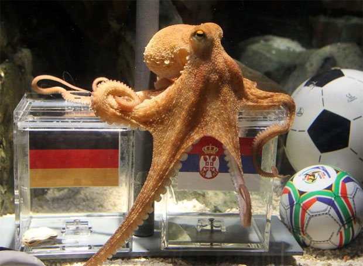
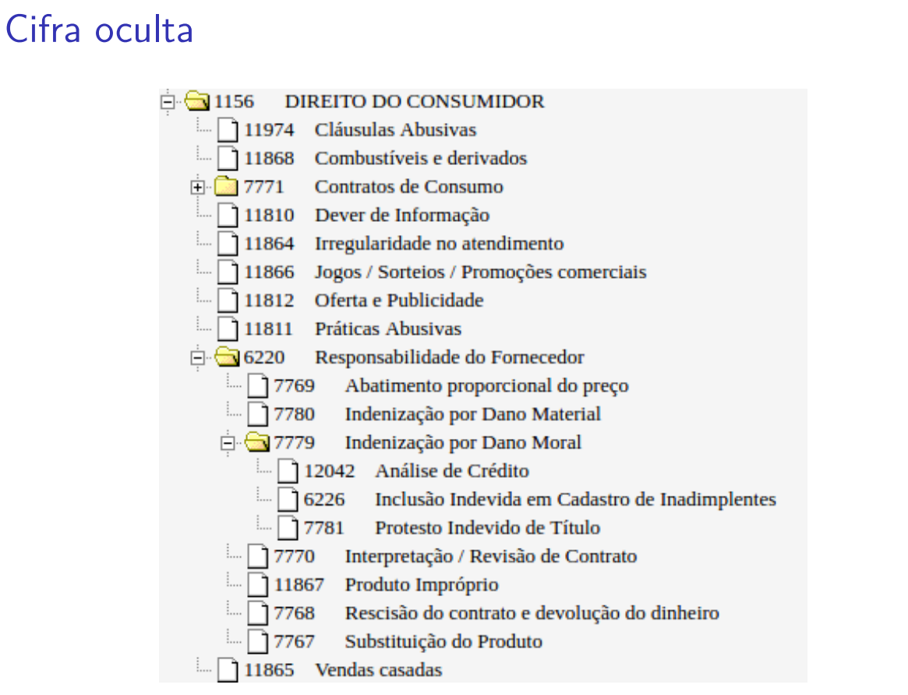
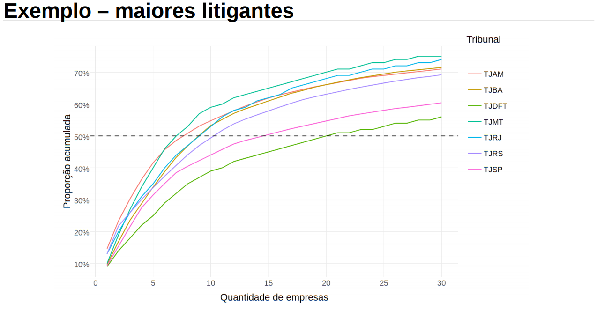
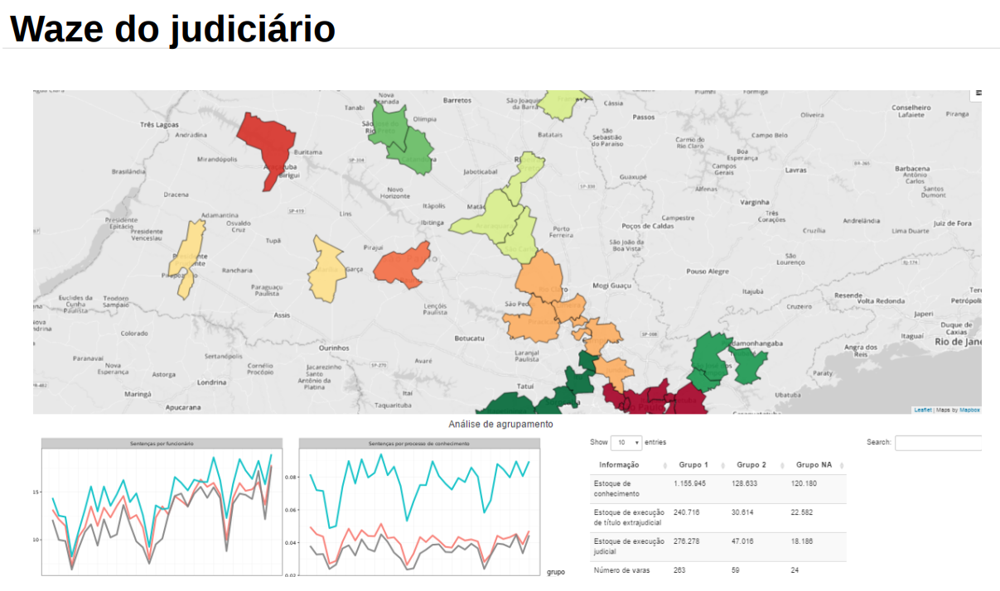

```{r setup, include=FALSE}
options(htmltools.dir.version = FALSE)
knitr::opts_chunk$set(echo=FALSE, warning=FALSE, message=FALSE,
                      out.width = "99%", fig.align = "center")
```

class: class: center, middle

# faxineiro de dados

```{r}
knitr::include_graphics("imgs/jtrecenti.png")
```

---

# Objetivos

### Pesquisa empírica em direito

--

### Jurimetria

--

### Exemplos

--

### Um pouco de coisas técnicas :)

---

# Referências

- [Research Design: Qualitative, Quantitative and Mixed Methods Approaches](https://www.amazon.com/Research-Design-Qualitative-Quantitative-Approaches/dp/1452226105)
- [Jurimetria: como a estatística pode reinventar o direito](https://www.saraiva.com.br/jurimetria-como-a-estatistica-pode-reinventar-o-direito-9325227.html)
- [R para ciência de dados](https://r4ds.had.co.nz)
- [R para jurimetria](https://abjur.github.com/r4jurimetrics)

---
class: inverse, middle, center

# Pesquisa empírica em direito

---

# Fluxo geral de pesquisa

```{r}
knitr::include_graphics("imgs/metodologia-1.png")
```

---

# Desenho da metodologia

```{r}
knitr::include_graphics("imgs/convergente.png")
```

---

# O que faz um estatístico?

### Gráficos e tabelas

--

### Conta mentiras com números

--

### Tortura dados até eles fornecerem informações

---

# Resposta

```{r, out.width="80%"}
knitr::include_graphics("imgs/bruxaria.jpeg")
```

Bruxaria :D

---

# Na verdade está mais pra isso

```{r, out.width="60%"}
knitr::include_graphics("imgs/bruxaria-2.jpeg")
```

---

# Alguns estatísticos famosos

```{r}
knitr::include_graphics("imgs/vidente.jpeg")
```

---

# Alguns estatísticos famosos

```{r, out.width="80%"}

```

---

# Alguns estatísticos famosos

```{r}
knitr::include_graphics("imgs/mick.jpeg")
```

---

# Diferenças entre bruxos e estatísticos

- O estatístico utiliza dados para aprender sobre um fenômeno.
- O estatístico sempre assume que está errado.
- Assim, é capaz de medir o erro cometido e controlar a incerteza.

---

# Como trabalhamos

```{r}
knitr::include_graphics("imgs/data-science.png")
```

---

# Programação

```{r, out.width="40%"}
knitr::include_graphics(c("imgs/cropped-rstudio.png", "imgs/python.png"))
```

---

# Wrap-up

--

### É importante definir hipóteses e desenhar pesquisa

--

### Precisa ser exequível

--

### Estatística é fundamental

---
class: inverse, middle, center

# Jurimetria

---

# Definição

- estatística aplicada ao direito

- empirismo aplicado ao direito

```{r, out.width="80%"}
knitr::include_graphics("imgs/diferenca.png")
```

---

# Esferas

```{r}
knitr::include_graphics("imgs/esferas.png")
```

---


```{r}
knitr::include_graphics("imgs/jurimetria_empresas.png")
```

---


```{r}
knitr::include_graphics("imgs/missoes_abj.png")
```

---

# Pesquisa jurimétrica: o que coletar?

--

### Escopo regional

Importante pois a dificuldade de uma pesquisa é proporcional à quantidade de tribunais analisados

--

### Escopo temporal

- Estudos retrospectivo ou prospectivo?
- Ou: processos mortos ou processos nascidos?

--

### Corte do tema

- Primeira ou segunda instância?
- Quais classes e assuntos?
- Quais tipos de partes?

---

# Estudos prospectivos e retrospectivos

```{r}
knitr::include_graphics("imgs/tempos.png")
```

---

# Coleta

```{r, out.width="90%"}
knitr::include_graphics("imgs/download_esaj.png")
```

---

# Faxina

```{r, out.width="90%"}
knitr::include_graphics("imgs/tidy_esaj.png")
```

---

# Modelagem

```{r, out.width="90%"}
knitr::include_graphics("imgs/model_esaj.png")
```

---

# Tipos de dados

### Populacional

### Amostra

```{r, out.width="40%"}
knitr::include_graphics("imgs/acordao.png")
```

---

# Problemas: acesso

```{r}
knitr::include_graphics("imgs/captcha.png")
```

```{r echo=TRUE, message=FALSE, warning=FALSE}
decryptr::decrypt("imgs/captcha.png", "rfb")
```


---

# Problemas: qualidade

```{r, out.width="80%"}

```

---

# Wrap-up

### Jurimetria é muito útil para pesquisa e prática

--

### É importante delimitar bem o escopo

--

### Os dados são ruins e difíceis de acessar

---
class: inverse, center, middle

# Exemplos

---

```{r, out.width="110%"}
knitr::include_graphics("imgs/varas_emp.png")
```

---

# Observatório da insolvência

```{r}
knitr::include_graphics("imgs/observatorio.png")
```

---

```{r, out.width="120%"}

```

---

```{r}
knitr::include_graphics("imgs/ml2.png")
```

---

```{r}
knitr::include_graphics("imgs/camaras.png")
```

---

# Boletim ABJ

```{r}
knitr::include_graphics("imgs/boletim.png")
```

---

```{r}

```

---

```{r}
knitr::include_graphics("imgs/adocao.png")
```

---

```{r}
knitr::include_graphics("imgs/drogas.png")
```

---
class: middle, center

# Exemplo prático

(no R)

---

# Stalk me

- Julio: [jtrecenti@abj.org.br](mailto:jtrecenti@abj.org.br)
- ABJ: [relacionamento@abj.org.br](mailto:relacionamento@abj.org.br)
- Site: https://abj.org.br
- Códigos: https://github.com/abjur
- Slides: https://jtrecenti.github.io/slides/cogeae/

--

```{r}
knitr::include_graphics("imgs/causality.jpg")
```

