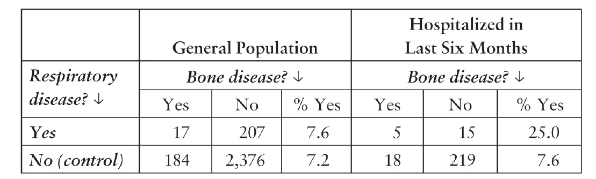
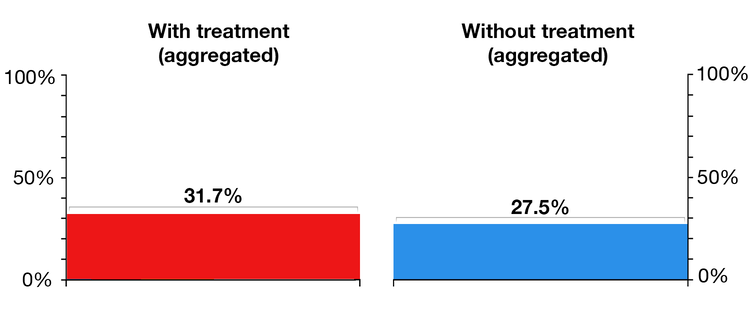

```{r setup, include=FALSE}
options(htmltools.dir.version = FALSE)
knitr::opts_chunk$set(warning=FALSE, message=FALSE, collapse = TRUE,
                      out.width = "90%", fig.align = "center")
library(tidyverse)
```

class: class: center, middle

# Faxineiro de dados

```{r, echo=FALSE}
knitr::include_graphics("imgs/jtrecenti.png")
```

---

## Novos tempos?

- Nos últimos anos os tipos de dados mudaram.
- Coisas muito importantes no mercado hoje em dia:

```{r echo=FALSE, out.width="23%", fig.align='default'}
knitr::include_graphics(c("imgs/friends.jpg", "imgs/acordao.png", "imgs/wave.png"))
```

---

## Deep Learning

- Popularidade recente da área de deep learning.

- Promete fazer muitas coisas.

- Tem um linguajar diferente do que estamos acostumados.

```{r echo=FALSE, out.width='70%'}
knitr::include_graphics("imgs/deepl.png")
```

---

## Problemas

- Muita, muita gente usando.

--

- Mercado está pedindo. Só se fala nisso.

--

- Não aprendemos nada disso na faculdade

--

- O que estudamos é ultrapassado?

---
class:inverse

## Não entre em pânico!

```{r, out.width="70%", echo=FALSE}
knitr::include_graphics("imgs/panic.jpg")
```

---
class: center, middle, inverse

# Teoria

---

# Judea Pearl

```{r, echo=FALSE, out.width="100%"}

```


---


# Três estruturas básicas

--

### Mediadores

A -> B -> C

--

### Confundidores / garfos

A <- B -> C

--

### Colisores

A -> B <- C

---

# Importância em regressão - mediador

```{r, out.width="20%", fig.align="center", echo=FALSE}
DiagrammeR::grViz("
digraph lr {
  # a 'graph' statement
  rankdir=LR
  node [shape = circle, fixedsize = true, width = 0.9]
  X1;X2;Y;

  # several 'edge' statements
  X1->X2;X2->Y
}
", width = 200, height = 150)
```

```{r}
n <- 1000
x1 <- rnorm(n)
x2 <- 1 + x1 + rnorm(n)
y <- 1 + x2 + rnorm(n)

modelo <- lm(y ~ x1 + x2)
coef(modelo)
```

--

```{r}
modelo <- lm(y ~ x2)
coef(modelo)
```

---

# Importância em regressão - confundidor

```{r, out.width="20%", fig.align="center", echo=FALSE}
DiagrammeR::grViz("
digraph lr {
  # a 'graph' statement
  rankdir=LR
  node [shape = circle, fixedsize = true, width = 0.9]
  X1;X2;Y;

  # several 'edge' statements
  X1->X2;X1->Y;X2->Y
}
", width = 200, height = 150)
```


```{r}
n <- 1000
x1 <- rnorm(n)
x2 <- 1 + 2 * x1 + rnorm(n)
y <- 1 + x1 + x2 + rnorm(n)

modelo <- lm(y ~ x1)
coef(modelo)
```

--

```{r}
modelo <- lm(y ~ x1 + x2)
coef(modelo)
```

---

# Importância em regressão - colisor

```{r, fig.align="center", echo=FALSE}
DiagrammeR::grViz("
digraph lr {
  # a 'graph' statement
  rankdir=LR
  node [shape = circle, fixedsize = true, width = 0.9]
  X2;Y;

  node [shape = circle, fixedsize = true, width = 0.9, color=red]
  X1
  
  # several 'edge' statements
  Y->X1;X2->X1
}
", width = 200, height = 150)
```


```{r}
x2 <- rnorm(n)
y <- rnorm(n)
x1 <- 1 + 2 * x2 + 3 * y + rnorm(n)

lm(y[x1 > 1] ~ x2[x1 > 1]) %>% 
  summary() %>% 
  broom::tidy()
```

---

# Importância em regressão - colisor

```{r}
lm(y ~ x2) %>% 
  summary() %>% 
  broom::tidy()
```

--

Viés de seleção

---

# Wrap-up

### Essas coisas não são ignoradas por estatísticos

--

### Não é possível verificar boa parte desses problemas nos dados

--

### Fazer diagramas causais ajuda a entender o problema

--

#### Pearl argumenta que não é só útil como necessário em problemas mais complexos

---
class: inverse, middle

# Paradoxos

---

# Monty Hall

```{r echo=FALSE, out.width="100%"}
knitr::include_graphics("imgs/montyhallproblem.png")
```

---

# Colisor!

```{r, fig.align="center", echo=FALSE}
DiagrammeR::grViz("
digraph lr {
  # a 'graph' statement
  rankdir=LR
  node [shape = circle, fixedsize = true, width = 0.9]
  Escolha1;Carro;

  node [shape = circle, fixedsize = true, width = 0.9, color=red]
  Apres
  
  # several 'edge' statements
  Escolha1->Apres;Carro->Apres
}
", width = 500, height = 550)
```

---

# Paradoxo de Berkson

```{r echo=FALSE, out.width="100%"}

```

---

# Colisor!

```{r, fig.align="center", echo=FALSE}
DiagrammeR::grViz("
digraph lr {
  # a 'graph' statement
  rankdir=LR
  node [shape = circle, fixedsize = true, width = 0.9]
  Doenca1;Doenca2;

  node [shape = circle, fixedsize = true, width = 0.9, color=red]
  Hospital
  
  # several 'edge' statements
  Doenca1->Hospital;Doenca2->Hospital
}
", width = 500, height = 550)
```


---

# Paradoxo de Simpson

```{r echo=FALSE, out.width="100%"}

```

---

# Paradoxo de Simpson

```{r echo=FALSE, out.width="100%"}
knitr::include_graphics("imgs/simpson2.png")
```

---

# Confundimento!

```{r, echo=FALSE}
DiagrammeR::grViz("
digraph lr {
  # a 'graph' statement
  rankdir=LR
  node [shape = circle, fixedsize = true, width = 0.9]
  IdadeSex;Tratamento;

  node [shape = circle, fixedsize = true, width = 0.9, color=red]
  Melhorar
  
  # several 'edge' statements
  Tratamento->Melhorar;IdadeSex->Tratamento;IdadeSex->Melhorar
}
", width = 500, height = 300)
```

--

Nesse caso, temos de controlar por Idade e sexo

---

# Outro exemplo!

```{r echo=FALSE, out.width="100%"}
knitr::include_graphics("imgs/simpson3.png")
```

---

# Confundimento!

```{r, echo=FALSE}
DiagrammeR::grViz("
digraph lr {
  # a 'graph' statement
  rankdir=LR
  node [shape = circle, fixedsize = true, width = 0.9]
  Pressao;Tratamento;

  node [shape = circle, fixedsize = true, width = 0.9, color=red]
  Melhorar
  
  # several 'edge' statements
  Tratamento->Melhorar;Tratamento->Pressao;Pressao->Melhorar
}
", width = 500, height = 300)

```

--

Nesse caso, não é para controlar por pressão

---

# Wrap-up

### Diagramas causais resolvem paradoxos estatísticos facilmente

--

### Nem tudo está nos dados

--

### Reflexão: é possível implementar causalidade em deep learning?

---

# Me stalkeia

- CONRE-3: [jtrecenti@conre3.org.br](mailto:jtrecenti@conre3.org.br)
- Curso-R: [jtrecenti@curso-r.com](mailto:jtrecenti@curso-r.com)
- ABJ: [jtrecenti@abj.org.br](mailto:jtrecenti@abj.org.br)

## Páginas: 

- https://curso-r.com
- https://abj.org.br
- https://github.com/jtrecenti

Apresentação: https://jtrecenti.github.io/slides/encontro-conre3/
