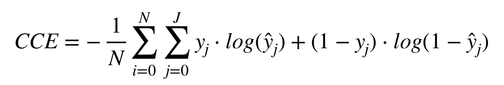

```{r setup, include=FALSE}
options(htmltools.dir.version = FALSE)
knitr::opts_chunk$set(echo=FALSE, fig.align="center")
```

<style type="text/css">
.remark-slide-content {
    font-size: 25px;
    padding: 1em 1em 1em 1em;
}
</style>

# Goals

.large[

* What are deep neural networks and how they work?
* What software we can use to train these models and how they relate to each other?
* How train deep learning models for some prediction problems?

]

---

# Requisites

.large[

* Linear regression
* Logistic regression
* R: pipe (`%>%`)

]

---

# References

.large[

* [Deep Learning Book](https://www.deeplearningbook.org)
* [Deep Learning with R](https://www.manning.com/books/deep-learning-with-r)
* [Tensorflow for R Blog](https://blogs.rstudio.com/tensorflow/)
* [Keras examples](https://keras.rstudio.com/articles/examples/index.html)
* [Colah's blog](http://colah.github.io)

]

```{r}
knitr::include_graphics("imgs/dlbook.jpg")
```

---

# Why "Deep" Learning?

.large[

* We use many composite nonlinear operations, called *layers*, to learn a representation
* The number of layers is the model depth
* Nowadays we have models with more than 100 layers

]

--

## Alternative names

.large[

- layered representations learning
- hierarchical representations learning

]

---

# Layers

```{r}
knitr::include_graphics("imgs/layers.png")
```

---

# Deep Learning

```{r}
knitr::include_graphics("imgs/structure1.png")
```


---

# Deep Learning

```{r}
knitr::include_graphics("imgs/structure2.png")
```

---

# Deep Learning

```{r}
knitr::include_graphics("imgs/structure3.png")
```

---

# Relation to Generalized Linear Models

.large[

- Linear regression: single layer neural network, no activation
- Logistic regression: single layer neural netork, logit activation

]

---

# Logistic regression

```{r}
knitr::include_graphics("imgs/glm.png")
```

---

# Deviance function

.large[

$$D(y,\hat\mu(x)) = \sum_{i=1}^n 2\left[y_i\log\frac{y_i}{\hat\mu_i(x_i)} + (1-y_i)\log\left(\frac{1-y_i}{1-\hat\mu_i(x_i)}\right)\right]$$

$$= 2 D_{KL}\left(y||\hat\mu(x)\right),$$

where $D_{KL}(p||q) = \sum_i p_i\log\frac{p_i}{q_i}$ is the Kullback-Leibler divergence.

]

---

# Deep learning

```{r echo=FALSE, out.width='80%'}
knitr::include_graphics("imgs/y1.png")
```

.large[

- Linear transformation of $x$, add bias and add some nonlinear activation.

$$f(x) = \sigma(wx + b)$$

]

--

#### Loss function

.large[

$$D_{KL}(p(x)||q(x))$$

]

--

```{r, out.width="10%", fig.align="center"}
knitr::include_graphics("imgs/thinking.png")
```

---

# Optimization: Stochastic Gradient Descent

```
for(i in 1:num_epochs) {
  grads <- compute_gradient(data, params)
  params <- params - learning_rate * grads
}
```

---

# SGD


---

# TensorFlow

.large[

It's a computational library

- Developed in Google Brain for neural network research
- Open Source
- Automatic Differentiation
- Uses GPU

]

```{r, out.width="80%"}
knitr::include_graphics("imgs/diff.png")
```

---

# Tensor

(2d)

```{r}
head(data.matrix(iris), 10)
```

---

# Tensor

(3d)


---

# Tensor

(4d)


---

# TensorFlow

.pull-left[
  
]

.pull-right[
  - Define the graph
  - Compile and optimize
  - Execute
  - Nodes are calculations
  - the tensors *flow* along the nodes.
]

---

# Keras

.large[

* API used to specify deep learning models in a intuitive flavor.

]

--

.large[

* Created by François Chollet (@fchollet).

]

```{r, align="center", out.width="50%"}

```

.large[

* Originally implemented in `python`.

]

---

# Keras + R

.large[

* R package: [`keras`](https://github.com/rstudio/keras).
* Based in [reticulate](https://github.com/rstudio/reticulate).
* Developed by JJ Allaire (CEO at RStudio).
* R-like syntax using `%>%`.

]

```{r echo=FALSE, message=FALSE, warning=FALSE, out.width="50%"}
knitr::include_graphics("imgs/jj.jpg")
```

---

# Keras for R

```{r echo=FALSE, message=FALSE, warning=FALSE}
knitr::include_graphics("imgs/keras.svg")
```

---

# Example 01

---

# Activation

```{r echo=FALSE, out.width="70%"}
knitr::include_graphics("imgs/activation.png")
```

---

# Activation problems

```{r, out.width="40%"}
knitr::include_graphics(c("imgs/derivative.png", "imgs/sigmoid.png"))
```


---

# Example 02

---

# Example 03

---

# Convolutions


--


--


---

# Convolutions

```{r, out.width="70%"}
knitr::include_graphics("imgs/convolutions.png")
```

---

# Max Pooling 


---

# Convolutions


---

# Binary Cross-Entropy

```{r}
knitr::include_graphics("imgs/binary_cross_entropy.png")
```

---

# Example 04

---

# Categorical Cross-Entropy

```{r}

```

---

# Example 05

---


# Stalk us

- Bruna Wundervald: [brunaw.com](brunaw.com)
- Curso-R: [contato@curso-r.com](mailto:jtrecenti@curso-r.com)
- CONRE-3: [jtrecenti@conre3.org.br](mailto:jtrecenti@conre3.org.br)

## Pages: 

- https://brunaw.com
- https://curso-r.com
- https://github.com/brunaw
- https://github.com/curso-r

Presentation: https://jtrecenti.github.io/slides/emr-dl/

Code: https://github.com/jtrecenti/slides


