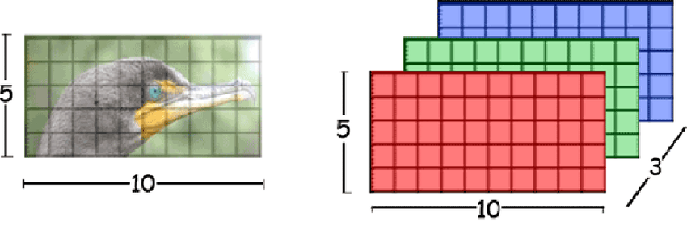
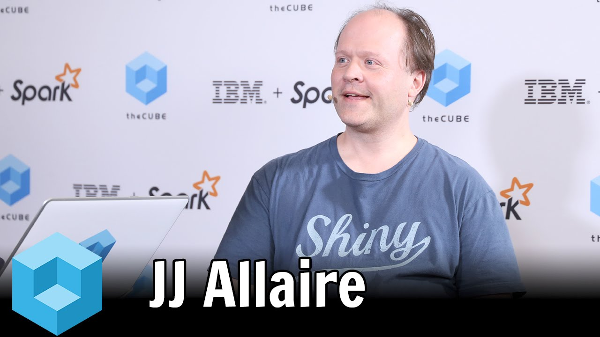

```{r setup, include=FALSE}
options(htmltools.dir.version = FALSE)
knitr::opts_chunk$set(echo = FALSE, message = FALSE, warning = FALSE,
                      fig.align = "center")
```

<style type="text/css">
.remark-slide-content, .remark-code {
    font-size: 24px;
    padding: 1em 1em 1em 1em;
}

.small-code .remark-code {
    font-size: 16px;
    padding: 1em 1em 1em 1em;
}

</style>

# Motivação

```{r echo=FALSE, out.width="60%"}
knitr::include_graphics("img/captcha.png")
```

--

- Desafios com resolução **fácil para humanos**, mas **difícil para robôs**. 

- Nasceram entre 2000-2002 em Carnegie Mellon para evitar _**spam**_ .

--

- Hoje são usados por muitos sites, inclusive para acesso de **dados públicos**.  

--

- Podemos argumentar que Captchas representam um **problema geral** da IA. 

---

# Objetivo

Buscar formas eficientes e gerais de resolver Captchas de imagens com textos. 

--

### O que faremos hoje?

1. Definir o problema do Captcha e suas variações.

--

1. Utilizar o pacote `decryptr` para resolver alguns Captchas.

--

1. Mostrar como resolver novos Captchas
    1. Fazer uma ponte entre regressão logística e redes neurais.
    1. Mostrar solução usando redes neurais convolucionais.

---

# Requisitos

**Teoria**:

* Regressão linear
* Regressão logística

--

**R**:

* Conhecer o pipe (`%>%`)
    - `install.packages("tidyverse")`
* instalar pacotes `tensorflow` e `keras`
    - `install.packages("tensorflow")`
    - `install.packages("keras")`
    - Rodar `tensorflow::install_tensorflow()`
    - Rodar `keras::install_keras()`
* instalar `decryptr` (não está no CRAN)
    - `devtools::install_github("decryptr/decryptr")`

---
class: inverse, middle

# 1. Definição do problema

---

# O que queremos?

- Criar uma função $g$ que 
    - recebe uma imagem $\mathbf X = \{x_{nmr} \in [0,1]\}_{N\times M \times R}$ e 
    - retorna um vetor de índices $\mathbf y = \{y_j \in \mathbb N\}_{L \times 1}$.
    
- $c_j \in \mathcal A$, o alfabeto (e.g. letras e algarismos).

- $L$ é o número de caracteres contidos na imagem (*comprimento* do Captcha).

- $y_j$ indica a presença de um caractere $c_j$, $j = 1, \dots, L$.

---

# Exemplo

```{r, out.width="40%"}
knitr::include_graphics("img/captcha.png")
```

--

- $X$: , 50x180x1 = 9000 valores

- $L = 6$

- $c_1 =$ `m` (13ª letra $\rightarrow$ 13º elemento) $,\dots,c_6 =$ `5` (6º número $\rightarrow$ 32º elemento)

- $y_1 = 13,\dots,y_6 = 32$

- $g(X) = y = [13\;\; 11\;\; 13\;\; 1\;\; 7 \;\;32]^\top$

---

# Variáveis explicativas

As variáveis **explicativas** são retiradas da imagem, uma matriz $\mathbf X = \{x_{ijk}\}_{N\times M \times R}$, em que 

- $N$ é o número de linhas, 
- $M$ é o número de colunas e 
- $R$ é o número de *cores*, ou *canais*. 

O elemento $x_{nm\cdot}$ é denominado *pixel*.

```{r, fig.cap="Pratap Singh, Bhupendra", out.width="70%"}

```

---

# Variável resposta

A **resposta** $\mathbf y \in \mathbb \{1, \dots, |\mathcal A|\}^L$ é um vetor de índices de tamanho fixo. 

- Cada elemento de $\mathbf y$ representa um elemento do alfabeto $\mathcal A$.

--

## Função objetivo

- Obter $g$ capaz de mapear $\mathbf y$ a partir de uma nova imagem $\mathbf X$

- Depende de uma amostra de imagens $\mathbf X_1, \dots, \mathbf X_S$, corretamente classificadas através do vetor $\mathbf y_1, \dots, \mathbf y_S$. 

- A tarefa é obter uma estimativa $\hat g$ para a função $g$ que minimiza

$$
R(g) = \mathbb E[\mathbb I(g(\mathbf X) \neq \mathbf Y)] = \mathbb P(g(\mathbf X) \neq \mathbf Y))
$$

para novas observações de $X$ e $Y$.

---
class: inverse, middle

# 2. Como faz? 

## O pacote `decryptr`

---

# Pacote decryptr

Até o momento o `decryptr` possui as seguintes restrições:

1. Apenas imagens `jpg` ou `png`.
1. Uma imagem possui apenas números e letras.
1. A quantidade de caracteres de um Captcha é fixa.
1. Dois Captchas de mesma origem têm sempre as mesmas dimensões.

O `decryptr` ainda não está no CRAN. Isso significa que para instalá-lo é necessário utilizar o `devtools`:

```{r eval=FALSE, echo=TRUE}
devtools::install_github('decryptr/decryptr')
```

---

# Fluxo de utilização

```{r fluxo, fig.cap='Fluxo de utilização do pacote decryptr.', echo=FALSE, out.width="60%", fig.align="center"}
knitr::include_graphics("img/fluxo.png")
```

---

# Funções do `decryptr`

As funções principais do `decryptr` são 

- `download_captcha()`: baixar imagens da web. 
- `read_captcha()`: adicionar metadados úteis a uma string com o caminho do Captcha.
- `load_captcha()`: carregar a imagem na memória.
- `plot.captcha()`: método `S3` para desenhar o Captcha na tela.
- `classify()`: método `S3` para classificar Captchas manualmente.
- `load_model()`: carregar um modelo já ajustado e armazenado no pacote `decryptrModels`
- `train_model()`: método `S3` para ajustar um modelo baseado em LeNet-5 para os Captchas.
- `decrypt()`: método `S3` para classificar um Captcha a partir de um modelo ajustado e um caminho de imagem.

---

# Download

A função `download_captcha()` tem cinco parâmetros:

- `url=` o link do Captcha que queremos baixar.
- `n=` a quantidade de Captchas a serem baixados.
- `path=` a pasta que queremos salvar a imagem.
- `secure=` se `TRUE`, fará o download com a opção `ssl_verifypeer = FALSE` ([veja esse post](http://curso-r.com/blog/2017/03/31/2017-03-31-ssl/))
- `ext=` extensão do arquivo (`jpg`/`jpeg` ou `png`).

--

Para facilitar a utilização do `decryptr`, adicionamos algumas atalhos do tipo `download_captcha("nome")`, que já contêm os padrões para download de alguns sites específicos:

---

# Download

- `download_captcha("rfb")`: [Consulta de CNPJ da Receita federal](http://www.receita.fazenda.gov.br/pessoajuridica/cnpj/cnpjreva/cnpjreva_solicitacao2.asp).
- `download_captcha("saj")`: [Sistema SAJ (vários Tribunais Estaduais)](https://esaj.tjsp.jus.br/cjsg/imagemCaptcha.do).
- `download_captcha("tjmg")`: [Tribunal de Justiça de Minas Gerais](http://www4.tjmg.jus.br/juridico/sf/captcha.svl).
- `download_captcha("tjrj")`: [Tribunal de Justiça do Rio de Janeiro](http://www4.tjrj.jus.br/consultaProcessoWebV2/captcha).
- `download_captcha("tjrs")`: [Tribunal de Justiça do Rio Grande do Sul](http://www.tjrs.jus.br/site_php/consulta/human_check/humancheck_showcode.php).
- `download_captcha("trt")`: [Tribunais Regionais do Trabalho](https://pje.trt3.jus.br/consultaprocessual/seam/resource/captcha).

---

# Download

Exemplo:

```{r eval=FALSE, echo=TRUE}
library(decryptr)
# salva arquivo em ./imgs/tjmg/captcha<id>.jpeg
arq <- download_captcha("tjmg", n = 1, path = 'img/tjmg') 
```

---

# Visualização

- Ler o(s) arquivo(s) com `read_captcha()` 
- Selecionar o captcha lido
- Usar a função `plot()`. Exemplo:

```{r fig.height=1.5, fig.width=4, fig.cap='Captcha do TJMG.',  echo=TRUE}
library(decryptr)
'img/tjmg/captchad217d7f4a06.jpeg' %>% 
  read_captcha() %>% 
  purrr::pluck(1) %>% 
  plot()
```

---

# Classificação

- Importante para possibilitar o treino de modelos preditivos. 
- Utilizar a função `classify()`, assim:

```{r fig.height=1.5, fig.width=4, fig.cap='Classificando Captcha do TJMG.', echo=TRUE, eval=FALSE}
'img/tjmg/captchad217d7f4a06.jpeg' %>% 
  classify()
```

--

Essa função executa duas tarefas:

- Plota o Captcha na tela.
- Abre um console para o usuário digitar o valor do Captcha manualmente.

--

**Detalhes**

- Ao escrever o valor o Captcha e pressionar `<enter>`, a função `classify()` adicionará a classificação no nome do arquivo da imagem. 
- A função `classify()` gera uma cópia para que seja impossível de perder a imagem original.

---

# Classificação

Algumas opções do `classify()`:

- `answers=` adicionar uma resposta ao invés de esperar abrir o console. Essa opção é útil quando as classficações são feitas automaticamente (e.g., por um quebrador de Captchas que usa o áudio no lugar da imagem.)
- `path=` colocar uma pasta para classificar os Captchas. Por padrão é a pasta onde os originais estão.

---

# Carregar modelo pré treinado

```{r, echo=TRUE, eval=FALSE}
modelo <- decryptr::load_model("tjmg")
modelo$model
```

.small-code[

```
# Layer (type)                   Output Shape                Param #    
# ======================================================================
# conv2d_4 (Conv2D)              (None, 40, 110, 4)          104        
# ______________________________________________________________________
# max_pooling2d_4 (MaxPooling2D) (None, 20, 55, 4)           0          
# ______________________________________________________________________
# conv2d_5 (Conv2D)              (None, 20, 55, 16)          1616       
...
# max_pooling2d_6 (MaxPooling2D) (None, 5, 13, 32)           0          
# ______________________________________________________________________
# flatten_2 (Flatten)            (None, 2080)                0          
# ______________________________________________________________________
# dense_3 (Dense)                (None, 16)                  33296      
...
# reshape_2 (Reshape)            (None, 5, 10)               0          
# ______________________________________________________________________
# activation_2 (Activation)      (None, 5, 10)               0          
# ======================================================================
# Total params: 48,698
# Trainable params: 48,698
# Non-trainable params: 0
```

]

---

# Resolver captcha

A função `decrypt` resolve o Captcha a partir de uma imagem e um modelo.

```{r,  echo=TRUE, eval=FALSE}
decrypt('img/tjmg/captchad217d7f4a06.jpeg', modelo)
#> "46247"
```

Também é possível chamar `decrypt` com o nome do modelo no lugar do próprio modelo carregado.

```{r,  echo=TRUE, eval=FALSE}
decrypt('img/tjmg/captchad217d7f4a06.jpeg', "tjmg")
#> "46247"
```


---
class: inverse, middle

# 3. Como funciona?

--

## Deep learning

* O que são, o que comem e onde vivem?

--

* Que softwares podemos utilizar e como eles se relacionam?

--

* Como treinar modelos de deep learning?

---

# Referências

.pull-left[
* [Deep Learning Book](https://www.deeplearningbook.org)
* [Deep Learning with R](https://www.manning.com/books/deep-learning-with-r)
* [Tensorflow for R Blog](https://blogs.rstudio.com/tensorflow/)
* [Keras examples](https://keras.rstudio.com/articles/examples/index.html)
* [Colah's blog](http://colah.github.io)
]

.pull-right[

```{r, out.width="80%"}
knitr::include_graphics("img/dlbook.jpg")
```

]


---

# Por quê "Deep" Learning?

- Um modelo é uma representação da realidade.
- Usamos várias operações não lineares compostas, chamadas *camadas* (*layers*), para criar uma representação.
- O número de camadas é a profundidade do modelo
- Hoje em dia temos modelos com centenas de camadas

--

## Nomes alternativos

- layered representations learning
    - Aprendizado de representações em camadas
- hierarchical representations learning
    - Aprendizado de representações hierárquicas

---

# Deep Learning

```{r}
knitr::include_graphics("img/structure1.png")
```


---

# Deep Learning

```{r}
knitr::include_graphics("img/structure2.png")
```

---

# Deep Learning

```{r}
knitr::include_graphics("img/structure3.png")
```

---

# Relação com Modelos Lineares Generalizados

- Regressão Linear = rede neural de uma camada, sem ativação
- Regressão Logíśtica = rede neural de uma camada, com ativação linear

--

```{r, out.width="25%"}
knitr::include_graphics("img/thinking.png")
```


---

# Regressão logística

```{r}
knitr::include_graphics("img/glm.png")
```

---

# Regressão logística

Componente aleatório

$$Y_i|x \sim \text{Bernoulli}(\mu_i)$$

Componente sistemático

$$\eta_i = \alpha + \sum_{j=1}^px_{ij}\beta_j$$

Função de ligação

$$g(\mu_i) = \log\left(\frac{\mu_i}{1-\mu_i}\right)$$

Ligando os componentes

$$\mu_i = g^{-1}(\eta_i) = \frac{1}{1+e^{-\eta_i}}$$

---

# Deviance

A log-verossimilhança é dada por

$$l(\boldsymbol \beta|\mathbf y) = \sum_{i=1}^n y_i\log(\mu_i) + (1-y_i)\log(1-\mu_i)$$

Uma forma útil de representar a log-verossimilhança é a partir da *função desvio*, dada por

$$D(\mathbf y|\boldsymbol \beta) = l(\mathbf y|\mathbf y) - l(\boldsymbol \beta|\mathbf y)$$

---

# Divergência de Kullback-Leibler

$$D_{KL}(p||q) = p\log\left(\frac p q\right) + (1-p)\log\left(\frac{1-p}{1-q}\right)$$

Deviance equivale à divergência de Kullback-Leibler

$$\begin{aligned}
D(\mathbf y|{ \boldsymbol \beta}) &= \sum_{i=1}^n y_i\log(y_i) + (1-y_i)\log(1-y_i) - \sum_{i=1}^n y_i\log(\mu_i) + (1-y_i)\log(1-\mu_i) \\
&=\sum_{i=1}^ny_i\log\left(\frac{y_i}{\mu_i}\right) + (1-y_i)\log\left(\frac{1-y_i}{1-\mu_i}\right) \\
&= \sum_{i=1}^n D_{KL}(y_i||\mu_i) \\
&= D_{KL}(\mathbf y||{\boldsymbol\mu}).
\end{aligned}$$

---

# Rede neural

```{r, out.width="80%"}
knitr::include_graphics("img/y1.png")
```


- Componente aleatório: é equivante à divergência KL / Deviance.

--

- Componente sistemático: viés e matriz de pesos. Ativação:

$$b^1 = \alpha^1\;\;\;\;\;\;\; W^1 = \left[\begin{array}{c}\beta^1_{1}\;\; \cdots  \;\;\beta^1_{p}\;\end{array}\right]$$

--

- Função de ligação: função de ativação

$$Z^1 = g(W^1X^\top + b^1)$$

---

# Generalizando

Rede neural com duas unidades de ativação:

$$b^1 = \left[\begin{array}{cc}\alpha^1_1\\ \alpha^1_2\end{array}\right]\;\;\;\;\;\;\; W^1 = \left[\begin{array}{cc}\beta^1_{1,1}\;\beta^1_{1,2}\\ \vdots \\ \beta^1_{p,1}\;\beta^1_{p,2}\end{array}\right]^\top$$

--

- Outputs da aplicação linear + função não linear viram novos inputs
- Aplicamos operações lineares e não lineares iterativamente

---

# Ou seja,

- Um modelo de regressão logística é equivalente a uma rede neural com uma camada e uma unidade de ativação

--

- Podemos usar $Z^1$ como uma nova matriz $X$, iterativamente

--

- Isso torna o modelo altamente não-linear

--

- Dificuldades de otimização...

---

# Otimização

- A forma usual de minimizar a deviance é diferente nos dois modelos.

--

- A regressão logística utiliza Newton-Raphson/Fisher Scoring (segunda derivada)

$$\beta_{new} = \beta - \mathcal I_\beta^{-1}\mathcal U_\beta,$$

onde 

- $\mathcal U_\beta$ é o vetor escore (gradiente) e

- $\mathcal I_\beta$ é a matriz de Informação (esperança da Hessiana).

---

# Otimização

- A rede neural utiliza descida de gradiente (primeira derivada)

$$\beta_{new}=\beta - \alpha\,\mathcal U_\beta$$

--

```
for(i in 1:num_epochs) {
  grads <- compute_gradient(data, params)
  params <- params - learning_rate * grads
}
```

mais: http://bit.ly/athos-menor-dl

---

# Descida de Gradiente Estocástica


---

# TensorFlow

Biblioteca computacional desenvolvida na Google Brain para trabalhar com redes neurais, com essas vantagens:

--

- Open Source
- Diferenciação automática
- Utiliza *Graphical Processing Units* (GPUs)

```{r, out.width="80%"}
knitr::include_graphics("img/diff.png")
```

---

# Tensor

(2d)

```{r}
head(data.matrix(iris), 10)
```

---

# Tensor

(3d)


---

# Tensor

(4d)


---

# TensorFlow

.pull-left[
  
]


.pull-right[
  - Define o grafo
  - Compila e otimiza
  - Executa
  - Vértices são cálculos
  - os tensores *fluem* através dos vértices.
]

---

# Keras

* API usada para especificar modelos de deep learning de forma intuitiva

--

* Criado por François Chollet (@fchollet).

```{r, align="center", out.width="50%"}
knitr::include_graphics("img/chollet.jpg")
```

* Originalmente implementado em `python`.

---

# Keras + R

* R package: [`keras`](https://github.com/rstudio/keras).
* Baseado no [reticulate](https://github.com/rstudio/reticulate).
* Desenvolvido por by JJ Allaire (CEO at RStudio).
* Sintaxe tidy: usa o `%>%`.

```{r echo=FALSE, message=FALSE, warning=FALSE, out.width="50%"}

```

---

# Keras para R

```{r echo=FALSE, message=FALSE, warning=FALSE}
knitr::include_graphics("img/keras.svg")
```

---

# Exemplo 01

---

# Ativação

```{r echo=FALSE, out.width="70%"}
knitr::include_graphics("img/activation.png")
```

---

# Problemas

```{r, out.width="40%"}
knitr::include_graphics(c("img/derivative.png", "img/sigmoid.png"))
```


---

# Exemplo 02

--

# Exemplo 03

---

# Redes neurais convolucionais

- O modelo aplica uma operação diferente de $X\beta$ para produzir $\eta$, que explora a proximidade entre pixels. Essa operação é chamada convolução. 

Por exemplo, considere a matriz de pesos 3x3

$$W = \left[\begin{array}{rrr}-1&-1&-1\\0&0&0\\1&1&1\end{array}\right]$$

--

E a janela 3x3 a partir do ponto $(12,16)$ da matriz $X$

$$X_{12,16} = \left[\begin{array}{rrr}
0.98 & 0.53 & 0.79 \\ 
0.97 & 0.99 & 1.00 \\ 
0.98 & 1.00 & 1.00 
\end{array}\right]$$

---

# Redes neurais convolucionais

A convolução de $X$ por $W$ no ponto $(12,16)$ é dada por

$$\begin{aligned}
(X_{12,16} *w )_{12,16}
&= w_{1,1}x_{11,15} + w_{1,2}x_{11,16} + w_{1,3}x_{11,17} + \\
&+ w_{2,1}x_{12,15} + w_{2,2}x_{12,16} + w_{2,3}x_{12,17} + \\
&+ w_{3,1}x_{13,15} + w_{3,2}x_{13,16} + w_{3,3}x_{13,17}
\end{aligned}$$

--

Desenhando:

---

# Convoluções


--


--


---

# Max Pooling 


---

# Exemplo 04

--

# Exemplo 05

--  

# Exemplo 06

---

# Resultados

<table>
<tr> <th>Imagem             </th> <th>Nome</th> <th>N</th>     <th>Taxa de acerto</th></tr>
<tr> <td></td> <td>RFB</td>  <td>27000</td> <td>98%</td></tr>
<tr> <td></td> <td>TRT</td>  <td>410</td> <td>98%</td></tr>
<tr> <td></td> <td>TJMG</td>  <td>10000</td> <td>100%</td></tr>
<tr> <td></td> <td>RSC</td>  <td>11000</td> <td>99%</td></tr>
<tr> <td></td> <td>CADESP</td>  <td>10000</td> <td>98%</td></tr>
</table>

```{r eval=FALSE} 
library(magrittr)
tibble::tibble(
  Imagem = c("</img>", 
             "</img>", 
             "</img>", 
             "</img>",
             "</img>"), 
  Nome = c("RFB", "TRT", "TJMG", "RSC", "CADESP"), 
  N = c(27000, 410, 10000, 11000, 10000),
  `Taxa de acerto` = c("98%", "98%", "100%", "99%", "98%")
) %>% pander::pander()
  
  
  # knitr:::kable(caption = "Resultados da aplicação dos modelos.", format = "html")
```

---

# Problemas e próximos passos

Possíveis soluções para problemas de eficiência e generalização:

```{r solucoes, echo=FALSE}
library(magrittr)
tibble::tribble(
  ~Eficiência, ~Generalização,
  "Reciclagem", "Ruído",
  "Enriquecimento", "Ensemble",
  "Feedback", ""
) %>% 
  knitr::kable(caption = "", 
               format = 'html')
```

--

- **reciclagem**: aplicar métodos de *data augmentation*.

--

- **ruído**: mesmo princípio da reciclagem, mas tem foco na generalização. 

--

- **enriquecimento**: Aproveitar ferramentas (OCR) e bases de caracteres. 

--

- **ensemble**: usar parâmetros ajustados de um modelo em outro. 

--

- **feedback**: Aproveitar o oráculo com alguma técnica de aprendizado por reforço.

---

# Links

- [Série de posts na curso-r sobre Captchas](https://www.curso-r.com/tags/captcha/)

--

- Site [decryptr.xyz](https://decryptr.xyz)

---
class: inverse

# Agradecimentos

- Victor Fossaluza
- Rafael Izbicki
- Rafael Stern
- Bruna Wundervald
- Associação Brasileira de Jurimetria
- **Curso-R**: Athos, Caio, Daniel, Fernando, William

<a href="https://curso-r.com">

```{r, out.width="20%"}
knitr::include_graphics("img/logo-curso-2.png")
```

</a>

---

# Obrigado!

## Tese (em andamento)

- https://github.com/jtrecenti/doctorate
- [jtrecenti@curso-r.com](mailto:jtrecenti@curso-r.com)

## `decryptr`

- https://github.com/decryptr/decryptr

<a href="https://github.com/decryptr">

```{r, out.width="20%"}
knitr::include_graphics("img/22989908.jpeg")
```

</a>
