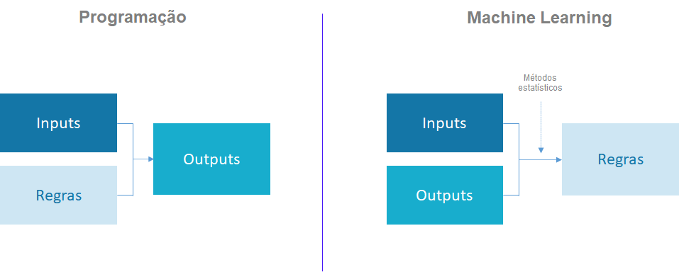

```{r, child="00-preamble.Rmd"}

```

class: middle

## O que é jurimetria?

--

## Jurimetria e inteligência artificial

--

## Jurimetria e LGPD

---

# O que é jurimetria?

- Jurimetria é a estatística aplicada ao direito

--

- A principal diferença entre pensamento abstrato e o pensamento jurimétrico é a **concretude**

--

- A Jurimetria é **complementar** ao pensamento do Direito

```{r, echo=FALSE, fig.align="center"}
knitr::include_graphics("https://r.abj.org.br/assets/logo-home.png")
```


---

# Como funciona?

```{r echo=FALSE}
knitr::include_graphics("img/ciclo-azul.png")
```

---

# Exemplo

```{r echo=FALSE, out.width="90%"}
knitr::include_graphics("https://github.com/abjur/covidTJSP/raw/master/man/figures/README-simple-plot-1.png")
```

https://github.com/abjur/covidTJSP

---
class: inverse, middle

# Jurimetria e inteligência artificial

---
# Dois paradigmas

```{r, echo=FALSE}

```


---
# Dois paradigmas

```{r, echo=FALSE}
knitr::include_graphics("https://christophm.github.io/interpretable-ml-book/images/programing-ml.png")
```

.font30[
*Imagem retirada do livro [Interpretable Machine Learning](https://christophm.github.io/interpretable-ml-book/).

]


---
# Na jurimetria não é diferente

```{r, echo=FALSE}
knitr::include_graphics("img/ml-jurimetria.png")
```


---
class: center, inverse, middle

# Jurimetria e LGPD

--

.pull-left[

### Interpretação de modelos complexos 

### (mais estatístico)

]

.pull-right[

### Dados abertos e dados pessoais 

### (mais jurídico)

]


---
# Interpretação de modelos simples

.pull-left[

```{r, echo=FALSE}
knitr::include_graphics("https://curso-r.github.io/main-regressao-linear/slides/02-regressao-linear_files/figure-html/unnamed-chunk-13-1.png")
```

$$y = \beta_0 + \beta_1 x$$

]


.pull-right[

### Interpretação matemática

$\beta_0$ é o lugar em que a reta cruza o eixo $Y$.


$\beta_1$ é a derivada de $Y$ em relação ao $X$. É quanto $Y$ varia quando $X$ varia em 1 unidade.

### Interpretação estatística

$\beta_0$ é a distância percorrida esperada quando o carro está parado (X = 0).

$\beta_1$ é o efeito médio na distância por variar 1 ml/h na velocidade do carro.

]

---

# Interpretação de modelos complexos

```{r echo=FALSE}
knitr::include_graphics("https://christophm.github.io/interpretable-ml-book/images/ice-cervical-centered-1.png")
```


---
# Interpretação de modelos complexos

.pull-left[

- Mostra efeitos aproximados de modelos complexos
- É uma das áreas da estatística que mais crescem nos últimos anos, junto com causalidade e avanços em métodos de otimização ou regularização
- [Livro sobre o assunto](https://christophm.github.io/interpretable-ml-book/)

]

.pull-right[

```{r echo=FALSE, out.width="90%"}
knitr::include_graphics("https://christophm.github.io/interpretable-ml-book/images/title_page.jpg")
```

]


---
# Jurimetria e dados abertos

**Afirmação**: se dados são públicos, eles devem ser acessíveis!

```{r, echo=FALSE, fig.align="center"}
knitr::include_graphics("https://memegenerator.net/img/instances/23908591.jpg")
```

---
# Como é hoje?

- Cada tribunal tem um sistema

--

- Diversos tipos de bloqueios (captchas, IP etc)

```{r echo=FALSE, fig.align="center"}
knitr::include_graphics("https://d33wubrfki0l68.cloudfront.net/3d6ba738372922bd5b9972d82611e92c74798e22/0748c/img/blog/captcha-conv/captcha_conv.gif")
```


--

- Os bloqueios não **impedem** o acesso automatizado aos dados; apenas **especializam**

--

- Muitas das lawtechs hoje são especializadas na extração e obtenção de dados.

--

- Faria muito mais sentido disponibilizar através de uma API.

---
# Como será no futuro?

- [Resolução 331 CNJ](https://atos.cnj.jus.br/atos/detalhar/3428)

--

- [CNJ Inova](https://www.cnj-inova.com). Nós vencemos!

--

- Existe um conflito nos princípios da publicidade dos dados e dos dados pessoais.

> Art. 11. Ato da Presidência disporá sobre as informações que serão disponibilizadas por meio de API pública para consulta aos metadados do DataJud, resguardados o sigilo e a confidencialidade das informações, nos termos da legislação processual e da Lei Geral de Proteção de Dados.

- **Quais dados são públicos, e quais são pessoais?**

--

Eu não sei. O que acham?

---

# Obrigado!

### Link: http://bit.ly/abj-lgpd

### Contato: [jtrecenti@abj.org.br](mailto:jtrecenti@abj.org.br)