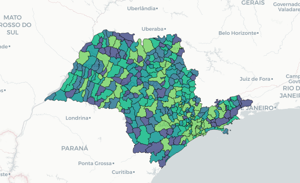
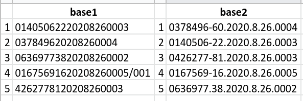
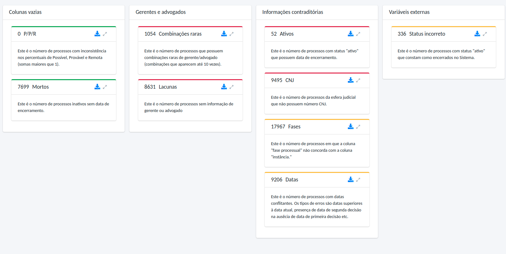
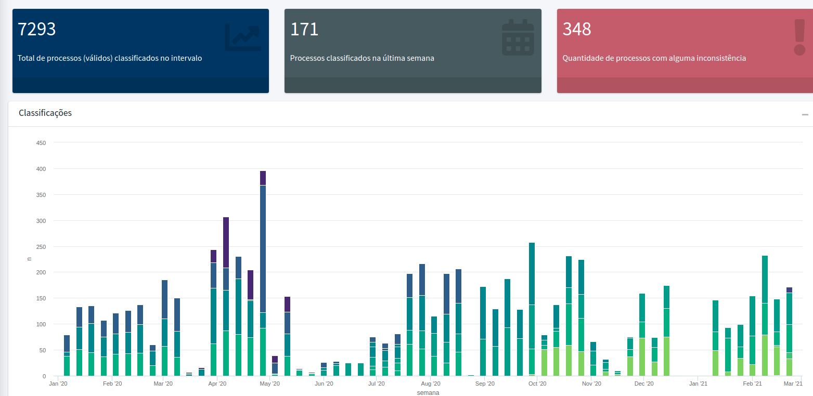

```{r setup, include=FALSE}
options(htmltools.dir.version = FALSE)
knitr::opts_chunk$set(echo=FALSE, warning=FALSE, message=FALSE,
                      out.width = "99%", fig.align = "center")
```

class: middle

<style type="text/css">
td {
  vertical-align: center;
}
</style>
<small>Faxineiro de dados</small>
<table style="border:none;border-color:none;">
<tr>
<td></td>
<td>Doutorando em Estatística no IME-USP</td>
</tr>
<tr>
<td></td>
<td>Secretário-geral da Associação Brasileira de Jurimetria</td>
</tr>
<tr>
<td></td>
<td>Sócio da Terranova Consultoria</td>
</tr>
<tr>
<td></td>
<td>Sócio da Curso-R</td>
</tr>
</table>

---

# Objetivos

.pull-left[

## Parte I: Conceitual

### Tidy data

### Joins

### Unidade amostral

]

--

.pull-right[

## Parte II: Prática

### Cases

### Um pouco de programação

]

---

# Referências

- [Jurimetria: como a estatística pode reinventar o direito](https://www.saraiva.com.br/jurimetria-como-a-estatistica-pode-reinventar-o-direito-9325227.html)
- [R para ciência de dados](https://r4ds.had.co.nz)
- [Livro da Curso-R](https://livro.curso-r.com)
- [R para jurimetria](https://abjur.github.com/r4jurimetrics)

---

# Como trabalhamos

```{r}
knitr::include_graphics("img/ciclo-ciencia-de-dados.png")
```

---

# Tidy data

Uma base *tidy* é uma base fácil de se trabalhar, isto é, fácil de se fazer manipulação de dados, fácil de se criar visualizações, fácil de se ajustar modelos e por aí vai.

--

.pull-left[

As propriedades mais importantes de uma base *tidy* são:

- cada coluna é uma variável.
- cada linha é uma observação.
- cada célula é um valor.

Essa definição proporciona uma maneira consistente de se referir a variáveis (nomes de colunas) e observações (índices das linhas).

]

.pull-right[

```{r, fig.cap="Imagem retirada do livro R4DS."}
knitr::include_graphics("img/tidy-1.png")
```

]


---

# Unidade amostral

Unidade amostral é o que define as observações de uma base de dados. Por exemplo, uma base pode ter como unidade amostral processos, ou como unidade amostral decisões, já que é possível ter mais de uma decisão por processo.

Cabe à pessoa gestora dos dados decidir como esses dados devem ser disponibilizados para análise.

Usualmente, a unidade amostral precisa de um **número identificador único** para permitir a integração com outras bases de dados.

---

# Exercício

.pull-left[

Meu interesse é calcular a taxa de reforma de decisões nas câmaras criminais em São Paulo.

a) O estudo é prospectivo ou retrospectivo?

b) Qual é a unidade amostral?

c) Quais são as colunas da base de dados para permitir a análise desejada?

]

.pull-right[

```{r}
knitr::include_graphics("https://abj.org.br/img/cases/camaras.png")
```

]

---

# Join

Join é a tarefa de juntar bases de dados pelas __linhas__ que compartilham __variáveis__ com __valores__ em comum.

Exemplos: 

- Juntar base de processos com variáveis socioeconômicas
- Juntar base de processos com base de movimentações / pagamentos
- Juntar base de processos com base de comarcas

---

# Tipos de join

```{r, fig.cap="Imagem retirada do livro R4DS.", out.width="40%", fig.align="center"}
knitr::include_graphics("https://d33wubrfki0l68.cloudfront.net/9c12ca9e12ed26a7c5d2aa08e36d2ac4fb593f1e/79980/diagrams/join-outer.png")
```


---

# Exercício

Queremos fazer um mapa das comarcas de São Paulo com cores proporcionais ao número de processos. Em mãos, tenho __três__ bases: uma base de __processos__, outra base com a relação de __comarcas e municípios__ e uma base com os __mapas__ dos municípios.

.pull-left[

a) O que eu preciso fazer com a base de processos?

b) Como juntar a base de processos com a base de comarcas/municípios

c) Como juntar a base de comarcas/municipios com a base que contém os mapas?

d) O que preciso fazer com os mapas?

]


.pull-right[

```{r}

```

]

---

# Partial matching

No caso dos mapas acima, nem sempre temos os valores batendo exatamente. Por exemplo, "Mogi-Mirim" pode estar escrito na forma "Mogi Mirim". 

Quando fazemos o join diretamente com os dados assim, os programas são incapazes de reconhecer que estamos trabalhando com a mesma comarca.

Nesse caso, temos duas alternativas:

- Adicionar rotinas de arrumação de dados: caixa alta/baixa, acentos, traços, padronização do número de caracteres, entre outros.

- Utilizar mecanismos de partial matching, como Fuzzy Join (por distância de Levenshtein, Jaccard etc), ou de forma mais sofisticada com Record Linkage

```{r, echo=TRUE, eval=FALSE}
stringdist::stringdist("Mogi-Mirim", "Mogi-Mirim")
stringdist::stringdist("Mogi-Mirim", "Mogi Mirim")
```

    [1] 0    
    [1] 1

---

# Exercício

.pull-left[

Temos duas bases de processos judiciais e queremos juntá-las. Uma vem da base interna do escritório / dejur e outra vem dos tribunais. Ambas têm como unidade amostral o processo, identificadas pelo número CNJ dos processos.

Ao fazer o join das bases, no entanto, obervamos 0 matchings. O que fazer?

]

.pull-right[

```{r}

```

]


---

# Wrap-up

### Sempre queremos deixar nossas bases no formato tidy

--

### Nem sempre é possível automatizar processos de integração

--

### Conhecimentos em programação geralmente ajudam

---
class: inverse, center, middle

# Cases

---

# Terravista

```{r}

```

https://trnv.shinyapps.io/mock/

---

# Observatórios da ABJ

```{r}

```


---

# Um pouco de programação

Exemplo dos mapas

```{r, out.width="50%"}
knitr::include_graphics("img/cat.gif")
```


---

# Stalk me

- Julio: [jtrecenti@abj.org.br](mailto:jtrecenti@abj.org.br)
- ABJ: [contato@abj.org.br](mailto:contato@abj.org.br)
- Site: https://abj.org.br
- Slides: https://jtrecenti.github.io/slides/futurelaw2021/
