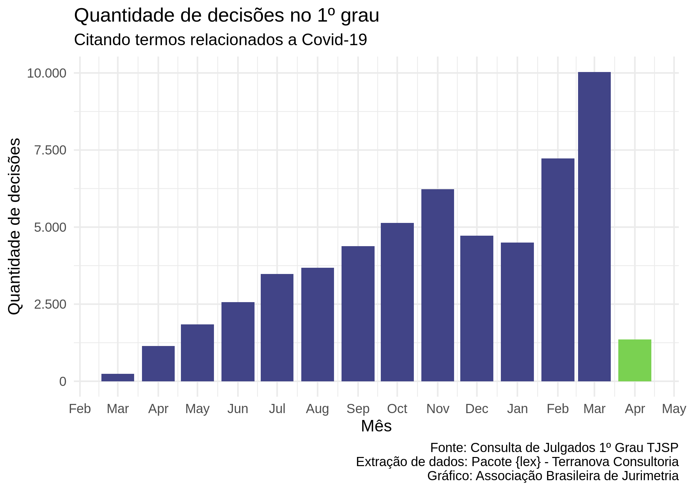
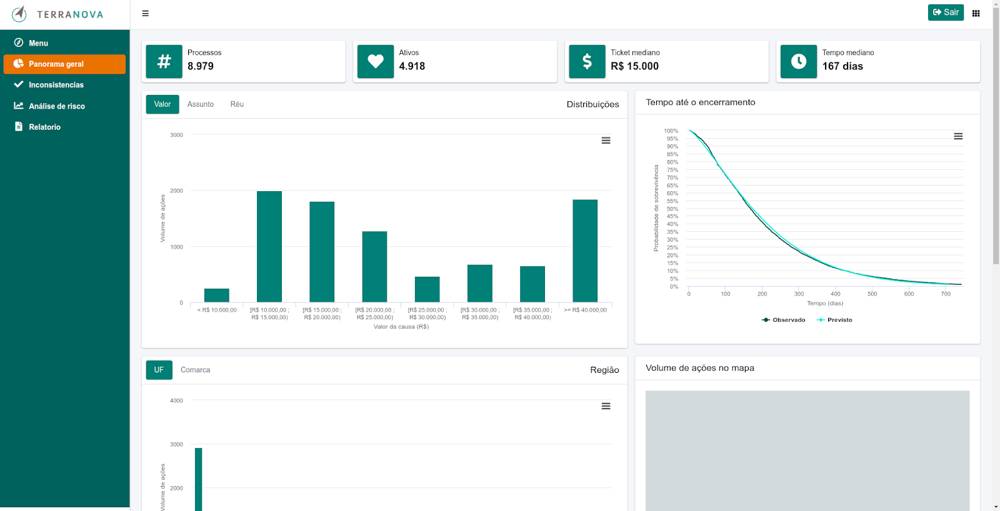
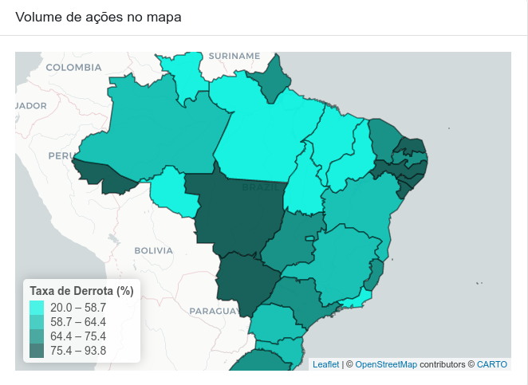
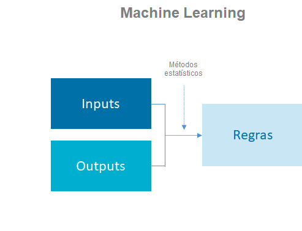
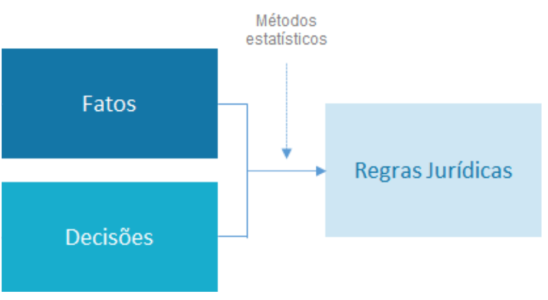
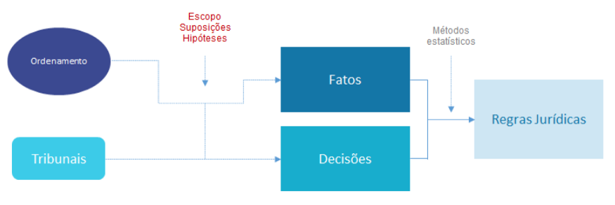

```{r setup, include=FALSE}
library(magrittr, include.only = "%>%")

options(htmltools.dir.version = FALSE)
knitr::opts_chunk$set(
  echo=FALSE, 
  warning=FALSE, 
  message=FALSE,
  out.width = "99%", 
  fig.align = "center",
  dpi = 300
)

crop <- function(im, left = 0, top = 0, right = 0, bottom = 0) {
  d <- dim(im[[1]]); w <- d[2]; h <- d[3]
  magick::image_crop(im, glue::glue("{w-left-right}x{h-top-bottom}+{left}+{top}"))
}

```

```{css}
p.caption {
  font-size: 0.6em;
}
```


# Apresentação

<style type="text/css">
td {
  vertical-align: center;
}
</style>
<small>Julio Trecenti: **faxineiro de dados**</small>
<table style="border:none;border-color:none;">
<tr>
<td></td>
<td>Doutorando em Estatística no IME-USP</td>
</tr>
<tr>
<td></td>
<td>Secretário-geral da Associação Brasileira de Jurimetria</td>
</tr>
<tr>
<td></td>
<td>Sócio da Terranova Consultoria</td>
</tr>
<tr>
<td></td>
<td>Sócio da Curso-R</td>
</tr>
</table>

---

# Agenda

.pull-left[.center[

## Parte I: conceitos

#### Definição

#### Escopo e abrangência

#### Exemplos

{{content}}

]]

--

## Parte II: pesquisa

#### Estruturas e fontes de dados

#### Acesso e dados abertos

--

.pull-right[.center[

## Parte III: negócios

#### Jurimetria e Inteligência Artificial

#### Introdução à jurimetria corporativa

#### Cases: Jurimetria corporativa

]]

---
class: inverse, middle

### Parte I: conceitual

# Definição

---

# O que é jurimetria?

- Jurimetria é a __estatística__ aplicada ao __direito__.

--

- Fazer jurimetria é pensar o direito de forma __concreta__, colocando nosso objeto de estudo no __tempo__ e no __espaço__.

--

- A jurimetria __complementa__ o estudo clássico do direito, considerando leis, __princípios__ jurídicos e pensamentos abstratos como __hipóteses__ que se manifestam ou não na __realidade__ através das __decisões__ judiciais.

--

<hr/>

.pull-left[

### Estudo clássico

Princípios jurídicos e pensamento de especialistas sobre o valor de indenização por dano moral a ser concedido no contexto de direito do consumidor.

]

--

.pull-right[

### Estudo jurimétrico

Valores típicos de dano moral em sentenças de primeira instância de processos envolvendo direito do consumidor no Tribunal de Justiça de São Paulo em 2020.

]

---

# Abrangência da jurimetria

Pode ser definida através de três esferas de aplicação:

```{r}
knitr::include_graphics("img/esferas.png")
```


---

# Abrangência da jurimetria

Pode ser definida através de três esferas de aplicação:

.pull-left[

### Incerteza em um caso

Processo judicial envolve uma questão probabilística.

- Verificação de paternidade.
- Perda de chance.
- Estatística forense.


{{content}}

]

--

### Análise de processos

Análise de bases de dados de processos, estabelecendo relações entre eles.

- Predição de decisões.
- Estratégia advocatícia.
- Caracterização.


--

.pull-left[

### Políticas públicas

Análise de impacto regulatório ou análise do resultado da aplicação de políticas públicas.

- Análise de impacto de leis.
- Proposição de medidas.
- Administração judiciária.


{{content}}

]

--

### &nbsp;

> A aplicação em políticas públicas se conecta com __outras áreas__ do conhecimento, como ciência política e economia.

---

# Stakeholders

A jurimetria auxilia e complementa os trabalhos de todas as pessoas que atuam no universo do direito.

.pull-left[

### Advocacia e empresas

- Estatística como tecnologia para arguição.
- Análise de risco, _due diligence_ e provisionamento.

{{content}}

]

--

### Juristas

- Pareceres jurimétricos.
- Análise da lei na ótica concreta.

--

.pull-right[

### Magistratura

- Melhores práticas para administração judiciária.
- Aprimoramento das decisões a partir da análise dos dados.

{{content}}

]

--

### Legislativo

- Estudo quantitativo de leis.
- Análise do impacto regulatório.


---

# Limites

&nbsp;

> A jurimetria __não substitui__ a pesquisa clássica no direito. Trata-se de um __complemento__ à pesquisa clássica, não uma alternativa.

--

&nbsp;

> A jurimetria não se limita à análise __processos judiciais__. O objeto de estudo pode envolver processos administrativos, leis e outras bases de dados. No entanto, como a análise de processos judiciais é a mais comum, temos um foco nesses conceitos e definições.

--

&nbsp;

> A jurimetria é __diferente__ de Análise Econômica do Direito (AED). Enquanto a AED toma o direito como objeto na __perspectiva econômica__, a jurimetria __emerge diretamente__ do direito, utilizando a estatística como __ferramenta__.

---
class: inverse, middle

### Parte I: pesquisa

# Cases

---

# Adoção

__Objetivo__: Analisar o tempo dos processos relacionados à adoção no Brasil.

```{r adocao, out.width='60%', fig.cap="Na parte vermelha, o gráfico mostra a distribuição das idades das crianças disponíveis em abrigos. Na parte azul, o gráfico mostra a distribuição das idades máximas que os pretendentes à adoção aceitam."}
"img/adocao.png" %>% 
  magick::image_read() %>% 
  crop(top = 100, bottom = 110)
```

__Resultado__: Lei 13.509/2017, com medidas que podem reduzir o tempo de processos relacionados à destituição do poder familiar.

---

# Maiores litigantes

__Objetivo__: Mapear os maiores litigantes em ações consumeristas.

```{r ml, out.width='65%', fig.cap="Proporção acumulada do total de processos consumeristas pela quantidade de litigantes, ordenando-se pelos maiores litigantes em sete unidades federativas."}
"img/cnjml.png" %>% 
  magick::image_read() %>% 
  crop(top = 110, bottom = 100)
```

__Resultado__: Integração entre sistema Consumidor.gov.br e Processo Judicial Eletrônico (PJe).

---

# Câmaras criminais

__Objetivo__: Analisar variabilidade da taxa de reforma das Câmaras Criminais.

```{r camaras, out.width='50%', fig.cap="Proporções de cada decisão em recursos de apelação contra o Ministério Público no Tribunal de Justiça de São Paulo. A cor mais escura mostra a proporção de recursos negados, a intermediária mostra a proporção de recursos parcialmente providos e a mais clara mostra a proporção de recursos providos."}
"img/camaras.png" %>% 
  magick::image_read() %>% 
  crop(top = 50, bottom = 120)
```

__Resultado__: Alta variabilidade nas taxas de recursos negados, que vai de 16% na 12ª Câmara Criminal até 81% na 4ª Câmara Criminal.


---

# Drogas

__Objetivo__: Estudar critérios objetivos para definir porte e tráfico de drogas.

```{r drogas, out.width='80%', fig.cap="Proporção de casos que seriam reclassificados em caso de utilização de quantidade de gramas de maconha para classificar o porte da droga como porte para uso (parte de cima) ou porte para tráfico (parte de baixo)."}
"img/drogas.png" %>% 
  magick::image_read() %>% 
  crop(top = 100, bottom = 10)
```

__Resultado__: Tomando como base as classificações temporárias definidas pelas autoridades policiais, é possível propor valores de corte ideais que balanceiam os dois tipos de injustiças.

---

# Observatório da insolvência

__Objetivo__: Compreender empiricamente o processo da insolvência.

```{r observatorio, out.width='50%', fig.cap="Relação entre remuneração do Administrador Judicial (AJ) e valor total da dívida da recuperanda. O valor máximo de remuneração do AJ deve ser de 5% do valor total da dívida."}
"img/obsfase2.png" %>% 
  magick::image_read() %>% 
  crop(top = 10, bottom = 10)
```

---
class: inverse, middle

### Parte II: pesquisa

# Fazendo uma pesquisa jurimétrica

---

# Como fazer uma pesquisa jurimétrica?

- Colocamos nosso objeto de estudo no tempo e no espaço.

- Logo, precisamos delimitar a abrangência regional e temporal do estudo.

- Também é necessário definir de forma precisa o escopo do estudo, ou seja, o que define se um caso específico é ou não parte do interesse da pesquisa.

---

# Exemplo: Covid

.pull-left[

```{r out.width="100%"}

```

]

--

.pull-right[

- Recorte temporal: 2020-2021
- Recorte regional: TJSP
- Escopo: Sentença que menciona palavras relacionadas à Covid.

Base de dados: https://github.com/abjur/covidTJSP

]


---

# Estudos prospectivos e retrospectivos

- Estudos __prospectivos__ acompanham processos desde seu __nascimento__, identificado pela data de distribuição, até sua morte, identificada pela sentença, trânsito em julgado, arquivamento, etc. 
  - Importante em análise de tempos.
  - Análise de sobrevivência.

--

Já estudos __retrospectivos__ são aqueles que indexam os processos por alguma data de __desfecho__, como uma sentença, um acórdão ou a data de arquivamento. 
  - Importante para análise de decisões.
  - Modelos preditivos.

---
class: inverse, middle

### Parte II: pesquisa

---

# Estruturas e fontes de dados

- __Diários de Justiça__: PDFs gigantescos contendo toda a movimentação judiciária. Não é fácil lista processos a partir desses arquivos. É útil para estudos prospectivos.

--

- __Consulta de jurisprudência__: Ferramentas de pesquisa dos tribunais. É mais fácil de consultar, mas ficamos reféns da qualidade da ferramenta de pesquisa.

--

- __DataJud__: No futuro, teremos uma base de dados acessível e completa disponibilizada pelo CNJ (Resolução 331/2020). 

---

# Estrutura de dados

- __Capa__: contém classe, assunto, vara, comarca, status, indicador de processo digital, local físico, entre outras. 

- __Partes__: contém nomes dos autores e dos réus, advogado e tipo de participação.  

- __Movimentações__: contém datas, títulos e conteúdo de todas as movimentações públicas do processo. São movimentações desde despachos simples, remessas e conclusos até ata de audiências e sentenças completas.

- __Pasta digital__: contém todos os autos do processo, incluindo petição inicial, contestação e outros documentos não publicáveis. Os documentos só estão disponíveis em processos digitais, com acesso somente a advogados e pesquisadores credenciados.

---

# Ciclo da ciência de dados

Como funciona na prática

```{r, out.width="65%"}
knitr::include_graphics("img/ciclo-ciencia-de-dados.png")
```

.small[Fonte: Curso-R e R para Ciência de Dados.]

---
class: inverse, middle

### Parte III: negócios

# Jurimetria corporativa

---

```{r, out.width="80%"}
knitr::include_graphics("img/jurimetria_empresas.png")
```


---

# Dados internos e externos

### Dados internos

Estão disponíveis nas bases da empresa ou escritório de advocacia.

--

### Dados externos

Dados do judiciário, obtidos na forma que definimos anteriormente. 

---

# Exemplo: painel de controle

Painel interativo, modular e customizado de acordo com as necessidades do cliente, contendo análises estratégicas, automações e curadoria da base de dados interna.

```{r, out.width="80%"}

```


---

# Exemplo: mapa estratégico

Extração e análise de dados provenientes dos tribunais para obter estatísticas de resultado e tempo dos processos de acordo com juiz, assunto e outras características do processo.

```{r, out.width="60%"}

```


---
class: inverse, middle

### Parte III: negócios

# Jurimetria e Inteligência Artificial

---

# O que é inteligência artificial?

- Hoje a inteligência artificial __está__ machine learning.

--

.pull-left[

```{r}
knitr::include_graphics("img/ia_esquerda.png")
```

]

--

.pull-right[

```{r}

```

]


---

# Aplicações de IA na jurimetria (1)

```{r, out.width="80%"}

```


---

# Aplicações de IA na jurimetria (2)

```{r}

```

---

# Referências

### [Jurimetria: como a estatística pode reinventar o direito](https://www.saraiva.com.br/jurimetria-como-a-estatistica-pode-reinventar-o-direito-9325227.html)
### [R para ciência de dados](https://r4ds.had.co.nz)

### [Livro da Curso-R](https://livro.curso-r.com)

### [R para jurimetria](https://abjur.github.com/r4jurimetrics)

---

# Stalk me

- Julio: [jtrecenti@abj.org.br](mailto:jtrecenti@abj.org.br)
- ABJ: [contato@abj.org.br](mailto:contato@abj.org.br)
- Site: https://abj.org.br
- Slides: https://jtrecenti.github.io/slides/docs/jurimetria/
