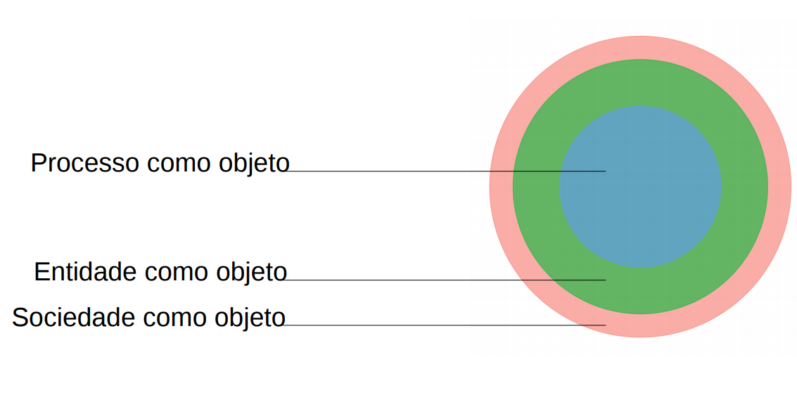

```{r setup, include=FALSE}
library(magrittr, include.only = "%>%")

options(htmltools.dir.version = FALSE)
knitr::opts_chunk$set(
  echo=FALSE, 
  warning=FALSE, 
  message=FALSE,
  out.width = "99%", 
  fig.align = "center",
  dpi = 300
)

crop <- function(im, left = 0, top = 0, right = 0, bottom = 0) {
  d <- dim(im[[1]]); w <- d[2]; h <- d[3]
  magick::image_crop(im, glue::glue("{w-left-right}x{h-top-bottom}+{left}+{top}"))
}

```

```{css}
p.caption {
  font-size: 0.6em;
}
```


# Apresentação

<style type="text/css">
td {
  vertical-align: center;
}
</style>
<small>Julio Trecenti: **faxineiro de dados**</small>
<table style="border:none;border-color:none;">
<tr>
<td></td>
<td>Doutorando em Estatística no IME-USP</td>
</tr>
<tr>
<td></td>
<td>Secretário-geral da Associação Brasileira de Jurimetria</td>
</tr>
<tr>
<td></td>
<td>Sócio da Terranova Consultoria</td>
</tr>
<tr>
<td></td>
<td>Sócio da Curso-R</td>
</tr>
</table>

---
class: inverse, middle

### Parte I: conceitual

# Definição

---

# O que é jurimetria?

- Jurimetria é a __estatística__ aplicada ao __direito__.

--

- Fazer jurimetria é pensar o direito de forma __concreta__, colocando nosso objeto de estudo no __tempo__ e no __espaço__.

--

- A jurimetria __complementa__ o estudo clássico do direito, considerando leis, __princípios__ jurídicos e pensamentos abstratos como __hipóteses__ que se manifestam ou não na __realidade__ através das __decisões__ judiciais.

--

<hr/>

.center[
## Exemplo
]

.pull-left[

### Estudo clássico

Princípios jurídicos e pensamento de especialistas sobre o valor de indenização por dano moral a ser concedido no contexto de direito do consumidor.

]

--

.pull-right[

### Estudo jurimétrico

Valores típicos de dano moral em sentenças de primeira instância de processos envolvendo direito do consumidor no Tribunal de Justiça de São Paulo em 2020.

]

---

# Abrangência da jurimetria

Pode ser definida através de três esferas de aplicação:

```{r}

```


---

# Abrangência da jurimetria

Pode ser definida através de três esferas de aplicação:

.pull-left[

### Incerteza em um caso

Processo judicial envolve uma questão probabilística.

- Verificação de paternidade.
- Perda de chance.
- Estatística forense.


{{content}}

]

--

### Análise de processos

Análise de bases de dados de processos, estabelecendo relações entre eles.

- Predição de decisões.
- Estratégia advocatícia.
- Caracterização de processos.


--

.pull-left[

### Políticas públicas

Análise de impacto regulatório ou análise do resultado da aplicação de políticas públicas.

- Análise de impacto de leis.
- Proposição de medidas.
- Administração judiciária.


{{content}}

]

--

### &nbsp;

> A aplicação em políticas públicas se conecta com __outras áreas__ do conhecimento, como ciência política e economia.

---

# Stakeholders

A jurimetria auxilia e complementa os trabalhos de todas as pessoas que atuam no universo do direito.

.pull-left[

### Advocacia e empresas

- Estatística como tecnologia para arguição.
- Análise de risco, _due diligence_ e provisionamento.

{{content}}

]

--

### Juristas

- Pareceres jurimétricos.
- Análise da lei na ótica concreta.

--

.pull-right[

### Magistratura

- Melhores práticas para administração judiciária.
- Aprimoramento das decisões a partir da análise dos dados.

{{content}}

]

--

### Legislativo

- Estudo quantitativo de leis.
- Análise do impacto regulatório.

---


```{r}
knitr::include_graphics("img/jurimetria_empresas.png")
```


---

# Limites

&nbsp;

> A jurimetria __não substitui__ a pesquisa clássica no direito. Trata-se de um __complemento__ à pesquisa clássica, não uma alternativa.

--

&nbsp;

> A jurimetria não se limita à análise __processos judiciais__. O objeto de estudo pode envolver processos administrativos, leis e outras bases de dados. No entanto, como a análise de processos judiciais é a mais comum, temos um foco nesses conceitos e definições.

--

&nbsp;

> A jurimetria é __diferente__ de Análise Econômica do Direito (AED). Enquanto a AED toma o direito como objeto na __perspectiva econômica__, a jurimetria __emerge diretamente__ do direito, utilizando a estatística como __ferramenta__.

---
class: inverse, middle

### Parte II: pesquisa

# Cases

---

# Adoção

__Objetivo__: Analisar o tempo dos processos relacionados à adoção no Brasil.

```{r adocao, out.width='90%', fig.cap="Na parte vermelha, o gráfico mostra a distribuição das idades das crianças disponíveis em abrigos. Na parte azul, o gráfico mostra a distribuição das idades máximas que os pretendentes à adoção aceitam."}
"img/adocao.png" %>% 
  magick::image_read() %>% 
  crop(top = 100, bottom = 110)
```

__Resultado__: Lei 13.509/2017, com medidas que podem reduzir o tempo de processos relacionados à destituição do poder familiar.

---

# Câmaras criminais

__Objetivo__: Analisar variabilidade da taxa de reforma das Câmaras Criminais.

```{r camaras, out.width='70%', fig.cap="Proporções de cada decisão em recursos de apelação contra o Ministério Público no Tribunal de Justiça de São Paulo. A cor mais escura mostra a proporção de recursos negados, a intermediária mostra a proporção de recursos parcialmente providos e a mais clara mostra a proporção de recursos providos."}
"img/camaras.png" %>% 
  magick::image_read() %>% 
  crop(top = 50, bottom = 120)
```

__Resultado__: Alta variabilidade nas taxas de recursos negados, que vai de 16% na 12ª Câmara Criminal até 81% na 4ª Câmara Criminal.

---

# Drogas

__Objetivo__: Estudar critérios objetivos para definir porte e tráfico de drogas.

```{r drogas, out.width='100%', fig.cap="Proporção de casos que seriam reclassificados em caso de utilização de quantidade de gramas de maconha para classificar o porte da droga como porte para uso (parte de cima) ou porte para tráfico (parte de baixo)."}
"img/drogas.png" %>% 
  magick::image_read() %>% 
  crop(top = 100, bottom = 10)
```

__Resultado__: Tomando como base as classificações temporárias definidas pelas autoridades policiais, é possível propor valores de corte ideais que balanceiam os dois tipos de injustiças.

---

# Educação

__Objetivo__: Aprimorar a taxonomia de assuntos envolvendo educação.

```{r taxonomia, out.width='100%', fig.cap="Reclassificações dos assuntos. Na parte da esquerda, a taxonomia atual. Na direita, a taxonomia proposta após análise dos casos. Pesquisa realizada em parceria com Instituto Articule."}
"img/taxonomia.png" %>% 
  magick::image_read() %>% 
  crop(top = 100, bottom = 10)
```


__Resultado__: Nova tabela de assuntos sobre educação para o CNJ.

---

# Como trabalhamos

```{r}
knitr::include_graphics("img/ciclo-ciencia-de-dados.png")
```

---

# Stalk me

- Julio: [jtrecenti@abj.org.br](mailto:jtrecenti@abj.org.br)
- ABJ: [contato@abj.org.br](mailto:contato@abj.org.br)
- Site: https://abj.org.br
- Slides: https://jtrecenti.github.io/slides/cedes/
