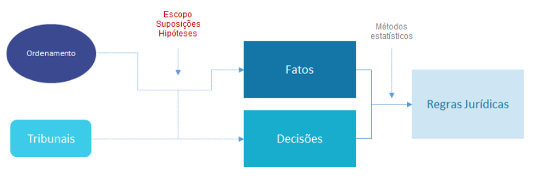

```{r setup, include=FALSE}
library(magrittr, include.only = "%>%")

options(htmltools.dir.version = FALSE)
knitr::opts_chunk$set(
  echo=FALSE, 
  warning=FALSE, 
  message=FALSE,
  out.width = "99%", 
  fig.align = "center",
  dpi = 300
)

crop <- function(im, left = 0, top = 0, right = 0, bottom = 0) {
  d <- dim(im[[1]]); w <- d[2]; h <- d[3]
  magick::image_crop(im, glue::glue("{w-left-right}x{h-top-bottom}+{left}+{top}"))
}

```

```{css}
p.caption {
  font-size: 0.6em;
}
```

# Apresentação

<style type="text/css">
td {
  vertical-align: center;
}
</style>
<small>Julio Trecenti: **faxineiro de dados**</small>
<table style="border:none;border-color:none;">
<tr>
<td></td>
<td>Doutorando em Estatística no IME-USP</td>
</tr>
<tr>
<td></td>
<td>Secretário-geral da Associação Brasileira de Jurimetria</td>
</tr>
<tr>
<td></td>
<td>Sócio da Terranova Consultoria</td>
</tr>
<tr>
<td></td>
<td>Sócio da Curso-R</td>
</tr>
</table>


---
class: inverse, middle

### Parte I: ABJ

# Definição

---

# O que é jurimetria?

- Jurimetria é a __estatística__ aplicada ao __direito__.

--

- Fazer jurimetria é pensar o direito de forma __concreta__, colocando nosso objeto de estudo no __tempo__ e no __espaço__.

--

- A jurimetria __complementa__ o estudo clássico do direito, considerando leis, __princípios__ jurídicos e pensamentos abstratos como __hipóteses__ que se manifestam ou não na __realidade__ através das __decisões__ judiciais.

--

<hr/>

.center[
## Exemplo
]

.pull-left[

### Estudo clássico

Princípios jurídicos e pensamento de especialistas sobre o valor de indenização por dano moral a ser concedido no contexto de direito do consumidor.

]

--

.pull-right[

### Estudo jurimétrico

Valores típicos de dano moral em sentenças de primeira instância de processos envolvendo direito do consumidor no Tribunal de Justiça de São Paulo em 2020.

]

---

# Regras jurídicas

```{r, out.width="100%"}

```

---

# A ABJ

### Reunir e incentivar pessoas pesquisadoras.

--

### Disciplinar a jurimetria como um ramo do conhecimento jurídico.

--

### Colaborar com entidades públicas e privadas com pesquisas aplicadas.

---

# Associados ABJ

```{r}

```

---

# Observatório da insolvência

__Objetivo__: Compreender empiricamente o processo da insolvência.

```{r observatorio, out.width='50%', fig.cap="Relação entre remuneração do Administrador Judicial (AJ) e valor total da dívida da recuperanda. O valor máximo de remuneração do AJ deve ser de 5% do valor total da dívida."}
"img/obsfase2.png" %>% 
  magick::image_read() %>% 
  crop(top = 10, bottom = 10)
```

---
class: inverse, middle

### Parte II: pesquisa

# Fazendo uma pesquisa jurimétrica

---

# Como fazer uma pesquisa jurimétrica?

- Colocamos nosso objeto de estudo no tempo e no espaço.

- Logo, precisamos delimitar a abrangência regional e temporal do estudo.

- Também é necessário definir de forma precisa o escopo do estudo, ou seja, o que define se um caso específico é ou não parte do interesse da pesquisa.

---

# Estruturas e fontes de dados

- __Diários de Justiça__: PDFs gigantescos contendo toda a movimentação judiciária. Não é fácil lista processos a partir desses arquivos. É útil para estudos prospectivos.

--

- __Consulta de jurisprudência__: Ferramentas de pesquisa dos tribunais. É mais fácil de consultar, mas ficamos reféns da qualidade da ferramenta de pesquisa.

--

- __DataJud__: No futuro, teremos uma base de dados acessível e completa disponibilizada pelo CNJ (Resolução 331/2020). 

---

# Estrutura de dados

- __Capa__: contém classe, assunto, vara, comarca, status, indicador de processo digital, local físico, entre outras. 

- __Partes__: contém nomes dos autores e dos réus, advogado e tipo de participação.  

- __Movimentações__: contém datas, títulos e conteúdo de todas as movimentações públicas do processo. São movimentações desde despachos simples, remessas e conclusos até ata de audiências e sentenças completas.

- __Pasta digital__: contém todos os autos do processo, incluindo petição inicial, contestação e outros documentos não publicáveis. Os documentos só estão disponíveis em processos digitais, com acesso somente a advogados e pesquisadores credenciados.

---

# Ciclo da ciência de dados

Como funciona na prática

```{r, out.width="85%"}
knitr::include_graphics("img/ciclo-ciencia-de-dados.png")
```

.small[Fonte: Curso-R e R para Ciência de Dados.]

---

# Tipos de empresa

```{r}

```

---

# Tipos de empresa

```{r}

```

---

# Distribuição

```{r}

```

---

# Resultados

```{r}

```

---

# Remunerção AJ

```{r, out.width="90%"}

```

---

# Plano Classe 1

```{r}

```

---

# Plano Classe 1

```{r}

```

---

# Desfecho

```{r}

```


---

# Stalk me

- Julio: [jtrecenti@abj.org.br](mailto:jtrecenti@abj.org.br)
- ABJ: [contato@abj.org.br](mailto:contato@abj.org.br)
- Site: https://abj.org.br
- Slides: https://jtrecenti.github.io/slides/docs/oabpr2021/
