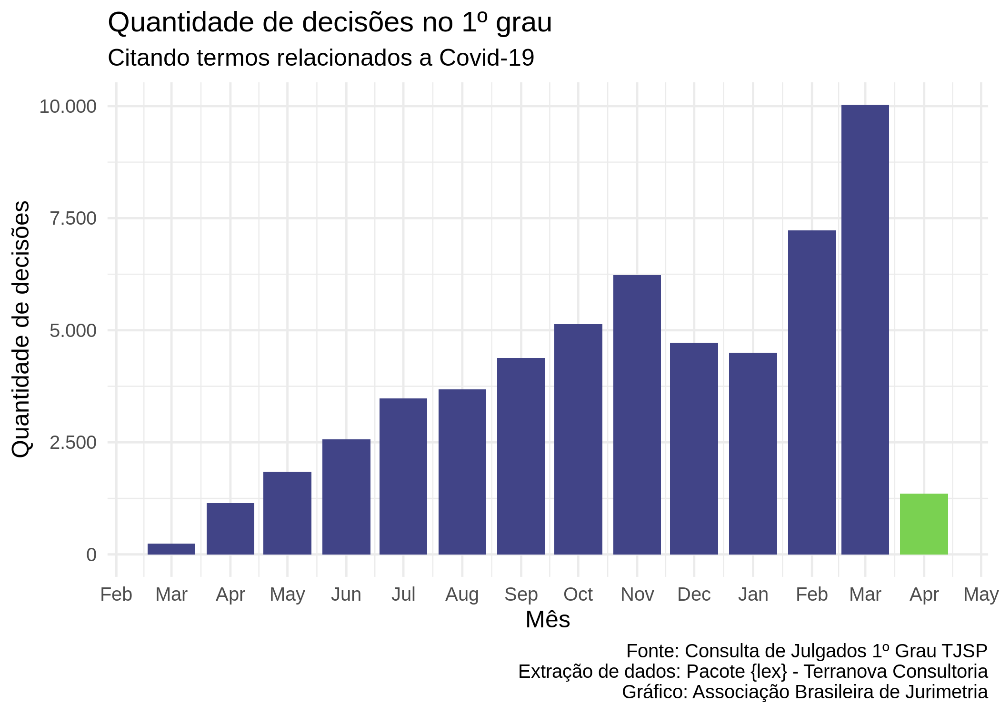

```{r setup, include=FALSE}
library(magrittr, include.only = "%>%")

options(htmltools.dir.version = FALSE)
knitr::opts_chunk$set(
  echo=FALSE, 
  warning=FALSE, 
  message=FALSE,
  out.width = "99%", 
  fig.align = "center",
  dpi = 300
)

crop <- function(im, left = 0, top = 0, right = 0, bottom = 0) {
  d <- dim(im[[1]]); w <- d[2]; h <- d[3]
  magick::image_crop(
    im, 
    glue::glue("{w-left-right}x{h-top-bottom}+{left}+{top}")
  )
}

```

```{css}
p.caption {
  font-size: 0.6em;
}
```


# Apresentação

<style type="text/css">
td {
  vertical-align: center;
}
</style>
<small>Julio Trecenti: **faxineiro de dados**</small>
<table style="border:none;border-color:none;">
<tr>
<td></td>
<td>Doutorando em Estatística no IME-USP</td>
</tr>
<tr>
<td></td>
<td>Secretário-geral da Associação Brasileira de Jurimetria</td>
</tr>
<tr>
<td></td>
<td>Sócio da Terranova Consultoria</td>
</tr>
<tr>
<td></td>
<td>Sócio da Curso-R</td>
</tr>
<tr>
<td></td>
<td>Professor auxiliar no Insper</td>
</tr>
</table>

---

# Agenda

.pull-left[.center[

## O que é

{{content}}

]]

--

## Exemplos

--

.pull-right[.center[

## Nosso Projeto

{{content}}

]]

--

## Próximos passos


---
class: inverse, middle

# O que é

---

# O que é jurimetria?

- Jurimetria é a __estatística__ aplicada ao __direito__.

--

- Fazer jurimetria é pensar o direito de forma __concreta__, colocando nosso objeto de estudo no __tempo__ e no __espaço__.

--

<hr/>

.center[
## Exemplo
]

.pull-left[

### Estudo clássico

Princípios jurídicos e pensamento de especialistas sobre o valor de indenização por dano moral a ser concedido no contexto de direito do consumidor.

]

--

.pull-right[

### Estudo jurimétrico

Valores típicos de dano moral em sentenças de primeira instância de processos envolvendo direito do consumidor no Tribunal de Justiça de São Paulo em 2020.

]

--

- A jurimetria __complementa__ o estudo clássico do direito, considerando leis, __princípios__ jurídicos e pensamentos abstratos como __hipóteses__ que se manifestam ou não na __realidade__ através das __decisões__ judiciais.

---

# Stakeholders

A jurimetria auxilia e complementa os trabalhos de todas as pessoas que atuam no universo do direito.

.pull-left[

### Advocacia e empresas

- Estatística como tecnologia para arguição.
- Análise de risco, _due diligence_ e provisionamento.

{{content}}

]

--

### Juristas

- Pareceres jurimétricos.
- Análise da lei na ótica concreta.

--

.pull-right[

### Magistratura

- Melhores práticas para administração judiciária.
- Aprimoramento das decisões a partir da análise dos dados.

{{content}}

]

--

### Legislativo

- Estudo quantitativo de leis.
- Análise do impacto regulatório.

---
class: inverse, middle

# Exemplos

---

# Adoção

__Objetivo__: Analisar o tempo dos processos relacionados à adoção no Brasil.

```{r adocao, out.width='60%', fig.cap="Na parte vermelha, o gráfico mostra a distribuição das idades das crianças disponíveis em abrigos. Na parte azul, o gráfico mostra a distribuição das idades máximas que os pretendentes à adoção aceitam."}
"img/adocao.png" %>% 
  magick::image_read() %>% 
  crop(top = 100, bottom = 110)
```

__Resultado__: Lei 13.509/2017, com medidas que podem reduzir o tempo de processos relacionados à destituição do poder familiar.

---

# Maiores litigantes

__Objetivo__: Mapear os maiores litigantes em ações consumeristas.

```{r ml, out.width='65%', fig.cap="Proporção acumulada do total de processos consumeristas pela quantidade de litigantes, ordenando-se pelos maiores litigantes em sete unidades federativas."}
"img/cnjml.png" %>% 
  magick::image_read() %>% 
  crop(top = 110, bottom = 100)
```

__Resultado__: Integração entre sistema Consumidor.gov.br e Processo Judicial Eletrônico (PJe).

---

# Câmaras criminais

__Objetivo__: Analisar variabilidade da taxa de reforma das Câmaras Criminais.

```{r camaras, out.width='50%', fig.cap="Proporções de cada decisão em recursos de apelação contra o Ministério Público no Tribunal de Justiça de São Paulo. A cor mais escura mostra a proporção de recursos negados, a intermediária mostra a proporção de recursos parcialmente providos e a mais clara mostra a proporção de recursos providos."}
"img/camaras.png" %>% 
  magick::image_read() %>% 
  crop(top = 50, bottom = 120)
```

__Resultado__: Alta variabilidade nas taxas de recursos negados, que vai de 16% na 12ª Câmara Criminal até 81% na 4ª Câmara Criminal.


---

# Drogas

__Objetivo__: Estudar critérios objetivos para definir porte e tráfico de drogas.

```{r drogas, out.width='80%', fig.cap="Proporção de casos que seriam reclassificados em caso de utilização de quantidade de gramas de maconha para classificar o porte da droga como porte para uso (parte de cima) ou porte para tráfico (parte de baixo)."}
"img/drogas.png" %>% 
  magick::image_read() %>% 
  crop(top = 100, bottom = 10)
```

__Resultado__: Tomando como base as classificações temporárias definidas pelas autoridades policiais, é possível propor valores de corte ideais que balanceiam os dois tipos de injustiças.

---

# Observatório da insolvência

__Objetivo__: Compreender empiricamente o processo da insolvência.

```{r observatorio, out.width='50%', fig.cap="Relação entre remuneração do Administrador Judicial (AJ) e valor total da dívida da recuperanda. O valor máximo de remuneração do AJ deve ser de 5% do valor total da dívida."}
"img/obsfase2.png" %>% 
  magick::image_read() %>% 
  crop(top = 10, bottom = 10)
```

---
class: stats

# Dashboard interativo

```{r}
knitr::include_graphics("img/vivopoc.gif")
```


---
class: inverse, middle

# Como faz

---

# Pesquisa jurimétrica?

- Colocamos nosso objeto de estudo no tempo e no espaço.

- Logo, precisamos delimitar a abrangência regional e temporal do estudo.

- Também é necessário definir de forma precisa o escopo do estudo, ou seja, o que define se um caso específico é ou não parte do interesse da pesquisa.

---

# Exemplo: Covid

.pull-left[

```{r out.width="100%"}

```

]

--

.pull-right[

- Recorte temporal: 2020-2021
- Recorte regional: TJSP
- Escopo: Sentença que menciona palavras relacionadas à Covid.

Base de dados: https://github.com/abjur/covidTJSP

]


---

# Estudos prospectivos e retrospectivos

- Estudos __prospectivos__ acompanham processos desde seu __nascimento__, identificado pela data de distribuição, até sua morte, identificada pela sentença, trânsito em julgado, arquivamento, etc. 
  - Importante em análise de tempos.
  - Análise de sobrevivência.

--

- Já estudos __retrospectivos__ são aqueles que indexam os processos por alguma data de __desfecho__, como uma sentença, um acórdão ou a data de arquivamento. 
  - Importante para análise de decisões.
  - Modelos preditivos.

---

# Estruturas e fontes de dados

- __Diários de Justiça__: PDFs gigantescos contendo toda a movimentação judiciária. Não é fácil lista processos a partir desses arquivos. É útil para estudos prospectivos.

--

- __Consulta de jurisprudência__: Ferramentas de pesquisa dos tribunais. É mais fácil de consultar, mas ficamos reféns da qualidade da ferramenta de pesquisa.

--

- __DataJud__: No futuro, teremos uma base de dados acessível e completa disponibilizada pelo CNJ (Resolução 331/2020). 

---

# Estrutura de dados

- __Capa__: contém classe, assunto, vara, comarca, status, indicador de processo digital, local físico, entre outras. 

- __Partes__: contém nomes dos autores e dos réus, advogado e tipo de participação.  

- __Movimentações__: contém datas, títulos e conteúdo de todas as movimentações públicas do processo. São movimentações desde despachos simples, remessas e conclusos até ata de audiências e sentenças completas.

- __Pasta digital__: contém todos os autos do processo, incluindo petição inicial, contestação e outros documentos não publicáveis. Os documentos só estão disponíveis em processos digitais, com acesso somente a advogados e pesquisadores credenciados.

---

# Nosso estudo

- Extração de dados via convênio com a JFCE.

- Resolução de captcha 

- Obtenção dos [dados do PJe](https://pje.jfce.jus.br/pje/ConsultaPublica/listView.seam)

- Classificação semi-automática, com revisão por amostragem.

---

# Questões norteadoras

1. Quais são os temas discutidos nos processos que envolvem saúde na JFCE?
1. Qual o grau de similaridade das peças processuais de um processo para outro?
1. Quais são os litigantes mais comuns na judicialização da saúde e os 1. representantes?
1. Houve tentativa de conciliação?
1. Como se dá o desfecho dos julgamentos?
1. Os pareceres do NATJUS são mencionados nas decisões judiciais?
1. Quanto tempo dura, em média, um julgamento de processo sobre saúde na JFCE?
1. Como é o uso de precedentes nos processos?
1. Como se dá o cumprimento das decisões liminares e definitivas?
1. Quais são os temas que geram maior divergência nos julgamentos sobre a saúde na JFCE?


---

# Dicionário pretendido (etapa 1)

```{r}

```


---

# Dicionário pretendido (etapas 1 e 2)

```{r}

```


---

# Dicionário pretendido  (etapa 2)

```{r}

```


---

# Análises na primeira etapa

1. Obter os processos da JFCE (etapa que estamos agora, via ofícios)
2. Baixar dados desses processos do PJe no tribunal (já montamos quase tudo, estamos apenas aguardando os processos chegarem)
3. Com base nos dados brutos obtidos em (2), construir a base de dados que será utilizada na pesquisa, segundo o dicionário de dados definido (apenas as colunas com "Origem" em capa, movimentações, e partes)
4. [__pesquisadores__] realizar a checagem das colunas obtidas, em uma etapa que chamamos de data quality. Em anexo um exemplo, de uma pesquisa que fizemos recentemente
5. Realizar as análises para responder às perguntas de pesquisa que estão referenciadas na tabela.


---

# Dashboard

```{r}
knitr::include_app("img/dashboard_obs.png")
```


---

# Referências

### [Jurimetria: como a estatística pode reinventar o direito](https://www.saraiva.com.br/jurimetria-como-a-estatistica-pode-reinventar-o-direito-9325227.html)
### [R para ciência de dados](https://r4ds.had.co.nz)

### [R para jurimetria](https://abjur.github.com/r4jurimetrics)

### [NDTJ](https://ndtj.com.br)


---

# Stalk me

- Julio: [julioazt@insper.edu.br](mailto:julioazt@insper.edu.br)
- ABJ: [contato@abj.org.br](mailto:contato@abj.org.br)
- Site: https://abj.org.br
- Slides: https://jtrecenti.github.io/slides/docs/unichristus/
