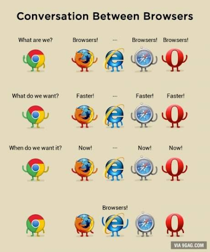
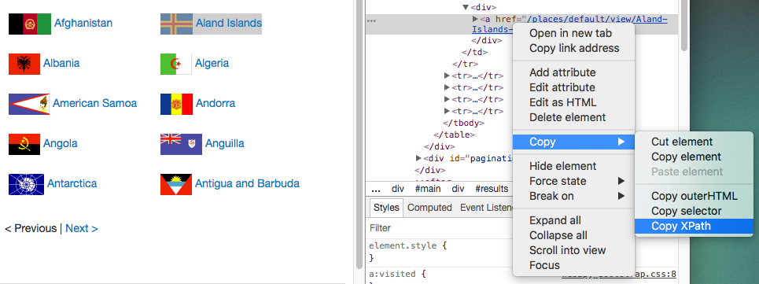

```{r setup, include=FALSE}
options(htmltools.dir.version = FALSE)
knitr::opts_chunk$set(
  echo=FALSE, 
  warning=FALSE, 
  message=FALSE,
  out.width = "99%", 
  fig.align = "center",
  dpi = 300
)
```

# Sobre mim

<style type="text/css">
td {
  vertical-align: center;
}
</style>
<small>Faxineiro de dados</small>
<table style="border:none;border-color:none;">
<tr>
<td></td>
<td>Doutorando em Estatística no IME-USP</td>
</tr>
<tr>
<td></td>
<td>Secretário-geral da Associação Brasileira de Jurimetria</td>
</tr>
<tr>
<td></td>
<td>Sócio da Terranova Consultoria</td>
</tr>
<tr>
<td></td>
<td>Sócio da Curso-R</td>
</tr>
</table>

---
class: middle, center, inverse

# Introdução

---
# O que é web scraping?

- Envolve acessar, baixar e organizar dados provenientes da web.

- É o "terceiro braço" de pessoas que trabalham com ciência de dados.

- Em português, "raspagem de dados".

- Não confundir com web crawling.

---

# Por que web scraping?

**Tudo o que você vê na internet pode se transformar dados para analisar!**

```{r echo=FALSE, fig.align="center"}
knitr::include_graphics("img/matrix.gif")
```


---

# Política do web scraping

## Quando usar

- Quando precisamos coletar um volume grande de dados da internet

## Quando não usar

- Existem formas mais simples de obter os dados (API, base de dados, etc.)

- Os termos de uso do site não nos permitem fazer isso.

- As informações do site não são públicas.

---

# Cuidados

- Risco de derrubar ou comprometer a estabilidade do site.

- Vale à pena conversar com a entidade detentora dos dados.

```{r echo=FALSE, fig.align="center"}
knitr::include_graphics("img/spiderman.gif")
```

---

# Tipos de problemas

- **APIs disponíveis**: O site fornece uma forma estruturada e documentada para acessar as páginas (com ou sem necessidade de fazer login).

- **APIs escondidas**: O site não fornece uma forma estruturada e documentada para acessar as páginas, mas internamente é alimentado por uma API não documentada, que podemos descobrir e usar.

- **HTML estático**: O site não fornece uma forma estruturada de acessar as páginas, e as páginas são geradas de forma estática (carregam sem necessidade de usar um navegador).

- **HTML dinâmico**: O site não fornece uma forma estruturada de acessar as páginas, e as páginas são geradas de forma dinâmica.

- ...

---

# Exemplo: Poke API

Veja aqui: https://pokeapi.co

```{r, eval=FALSE}
url_base <- "https://pokeapi.co/api/v2"      # nunca muda na mesma API
endpoint <- "/pokemon/ditto"                 # é o que muda o resultado
u_pokemon <- paste0(url_base, endpoint)      # cola os textos
httr::GET(u_pokemon) #<<
```

      Response [https://pokeapi.co/api/v2/pokemon/ditto]
        Date: 2020-11-09 16:55
        Status: 200
        Content-Type: application/json; charset=utf-8
        Size: 20.5 kB
      
---

# Exemplo: Poke API

Veja aqui: https://pokeapi.co

```{r, eval=FALSE}
url_base <- "https://pokeapi.co/api/v2"      # nunca muda na mesma API
endpoint <- "/pokemon/ditto"                 # é o que muda o resultado
u_pokemon <- paste0(url_base, endpoint)      # cola os textos
httr::GET(u_pokemon)
```

    * Response [https://pokeapi.co/api/v2/pokemon/ditto]
        Date: 2020-11-09 16:55
        Status: 200
        Content-Type: application/json; charset=utf-8
        Size: 20.5 kB

---

# Exemplo: Poke API

Veja aqui: https://pokeapi.co

```{r, eval=FALSE}
url_base <- "https://pokeapi.co/api/v2"      # nunca muda na mesma API
endpoint <- "/pokemon/ditto"                 # é o que muda o resultado
u_pokemon <- paste0(url_base, endpoint)      # cola os textos
httr::GET(u_pokemon)
```

      Response [https://pokeapi.co/api/v2/pokemon/ditto]
        Date: 2020-11-09 16:55
    *   Status: 200
        Content-Type: application/json; charset=utf-8
        Size: 20.5 kB

---

# Possíveis status

- `200` OK

- `302` Redirecionado

- `400` Requisição mal formatada

- `401` Não autorizado

- `404` Não encontrado

- `503` Erro no servidor

---

# Exemplo: Poke API

Veja aqui: https://pokeapi.co

```{r, eval=FALSE}
url_base <- "https://pokeapi.co/api/v2"      # nunca muda na mesma API
endpoint <- "/pokemon/ditto"                 # é o que muda o resultado
u_pokemon <- paste0(url_base, endpoint)      # cola os textos
httr::GET(u_pokemon)
```

      Response [https://pokeapi.co/api/v2/pokemon/ditto]
        Date: 2020-11-09 16:55
        Status: 200
    *   Content-Type: application/json; charset=utf-8
        Size: 20.5 kB

---
class: middle, center

# Usando o navegador

---

# Exemplo: Sabesp

- Nem sempre a API estará documentada.

- Neste caso, descobrimos sua existência "na raça".

- Técnicas mais importantes do profissional de raspagem:

### Inspecionar elemento

### Aba Network

---

# Vá ao seu navegador!

.pull-left[

Acesse: http://mananciais.sabesp.com.br/

]

.pull-right[

```{r, echo=FALSE}

```

]

---

# Inspect element

```{r, echo=FALSE}

```

---

# Vamos ao R!

```{r, echo=FALSE, fig.align="center", out.width="50%"}
knitr::include_graphics("img/cat.gif")
```

---

# Exemplo completo

Pacote `{mananciais}`, da [Beatriz Milz](https://beatrizmilz.com).

https://beatrizmilz.github.io/mananciais/

---

# Thanks!

https://linktr.ee/j.trecenti

