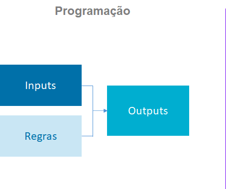
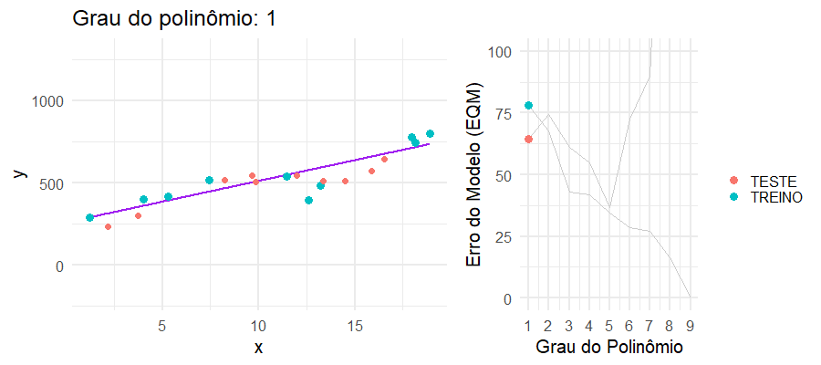

```{r setup, include=FALSE}
knitr::opts_chunk$set(
  echo = FALSE,
  fig.align = "center",
  out.width = "90%",
  message = FALSE,
  warning = FALSE
)

crop <- function(im, left = 0, top = 0, right = 0, bottom = 0) {
  d <- dim(im[[1]]); w <- d[2]; h <- d[3]
  magick::image_crop(im, glue::glue("{w-left-right}x{h-top-bottom}+{left}+{top}"))
}

xaringanExtra::use_panelset()
# xaringanExtra::use_scribble()
```


```{r}
library(metathis)
meta() %>%
  meta_general(
    description = "Introdução à Jurimetria",
    generator = "xaringan and remark.js"
  ) %>% 
  meta_name("github-repo" = "gadenbuie/drake-intro") %>% 
  meta_social(
    title = "Introdução à Jurimetria",
    url = "https://ndtj.github.io/main-jurimetria/slides/01-introducao-jurimetria.html#1",
    image = "https://ndtj.com.br/img/logo.png",
    image_alt = "Logo do NDTJ.",
    og_type = "website",
    og_author = "Julio Trecenti",
    twitter_card_type = "summary_large_image",
    twitter_creator = "@jtrecenti"
  )
```


# O que é jurimetria?

- Jurimetria é a __estatística__ aplicada ao __direito__.

--

- Fazer jurimetria é pensar o direito de forma __concreta__, colocando nosso objeto de estudo no __tempo__ e no __espaço__.

--

<hr/>

.center[
## Exemplo
]

.pull-left[

### Estudo clássico

Princípios jurídicos e pensamento de especialistas sobre o valor de indenização por dano moral a ser concedido no contexto de direito do consumidor.

]

--

.pull-right[

### Estudo jurimétrico

Valores típicos de dano moral em sentenças de primeira instância de processos envolvendo direito do consumidor no Tribunal de Justiça de São Paulo em 2020.

]

--

- A jurimetria __complementa__ o estudo clássico do direito, considerando leis, __princípios__ jurídicos e pensamentos abstratos como __hipóteses__ que se manifestam ou não na __realidade__ através das __decisões__ judiciais.

---
class: jurimetrics

# Para quem?

A jurimetria auxilia e complementa os trabalhos de todas as pessoas que atuam no universo do direito.

.pull-left[

### Advocacia e empresas

- Cobrança de honorários
- Análise de risco, _due diligence_ e provisionamento.

{{content}}

]

--

### Juristas

- Pareceres jurimétricos.
- Estatística como tecnologia para arguição.

--

.pull-right[

### Magistratura

- Melhores práticas para administração judiciária.
- Aprimoramento das decisões a partir da análise dos dados.

{{content}}

]

--

### Legislativo

- Estudo quantitativo de leis.
- Análise do impacto regulatório.

---

# Limites

&nbsp;

> A jurimetria __não substitui__ a pesquisa clássica no direito. Trata-se de um __complemento__ à pesquisa clássica, não uma alternativa.

--

&nbsp;

> A jurimetria não se limita à análise __processos judiciais__. O objeto de estudo pode envolver processos administrativos, leis e outras bases de dados. No entanto, como a análise de processos judiciais é a mais comum, temos um foco nesses conceitos e definições.

---
class: inverse, middle

# Cases

---
class: case

# Adoção

__Objetivo__: Analisar o tempo dos processos relacionados à adoção no Brasil.

```{r adocao, out.width='60%', fig.cap="Na parte vermelha, o gráfico mostra a distribuição das idades das crianças disponíveis em abrigos. Na parte azul, o gráfico mostra a distribuição das idades máximas que os pretendentes à adoção aceitam."}
"img/adocao.png" %>% 
  magick::image_read() %>% 
  crop(top = 100, bottom = 110)
```

__Resultado__: Lei 13.509/2017, com medidas que podem reduzir o tempo de processos relacionados à destituição do poder familiar.

---
class: case

# Câmaras criminais

__Objetivo__: Analisar variabilidade da taxa de reforma das Câmaras Criminais.

```{r camaras, out.width='50%', fig.cap="Proporções de cada decisão em recursos de apelação contra o Ministério Público no Tribunal de Justiça de São Paulo. A cor mais escura mostra a proporção de recursos negados, a intermediária mostra a proporção de recursos parcialmente providos e a mais clara mostra a proporção de recursos providos."}
"img/camaras.png" %>% 
  magick::image_read() %>% 
  crop(top = 50, bottom = 120)
```

__Resultado__: Alta variabilidade nas taxas de recursos negados, que vai de 16% na 12ª Câmara Criminal até 81% na 4ª Câmara Criminal.

---
class: case

# Observatório da insolvência

__Objetivo__: Compreender empiricamente o processo da insolvência.

```{r observatorio, out.width='50%', fig.cap="Relação entre remuneração do Administrador Judicial (AJ) e valor total da dívida da recuperanda. O valor máximo de remuneração do AJ deve ser de 5% do valor total da dívida."}
"img/obsfase2.png" %>% 
  magick::image_read() %>% 
  crop(top = 10, bottom = 10)
```

__Resultado__: Pesquisas do Núcleo de Estudo e Pesquisa sobre Insolvência (NEPI-PUC/SP).

---
class: jurimetrics

## Resumo

### Pensar jurimetria é pensar de forma __concreta__

--

### Todas as pessoas podem se beneficiar da jurimetria, de formas diferentes

--

### A jurimetria é complementar ao estudo clássico do direito, e tem limites

---
class: center, middle, inverse

# Inferência e predição

---
class: jurimetrics

# Ciclo de maturidade de dados

```{r, out.width="60%"}
knitr::include_graphics("img/maturidade-dados.png")
```

---
class: jurimetrics

# Cenário atual

- Por conta da dificuldade de acesso aos dados, ainda existe oportunidade para empresas especializadas em __extração de dados__.

- A maior parte das aplicações que vimos hoje são relacionadas a __visualização de dados__, com algumas aplicações pontuais de __modelagem__.

--

- A tomada de __decisão baseada em dados__ ainda é bastante incipente no mercado atual (mesmo que as empresas não falem isso explicitamente).

---
class: stats

# Modelagem preditiva

- Área da estatística destinada à construção de __modelos estatísticos__ capazes de fornecer boas predições para determinado fenômeno.

- Melhor introdução para o tema: [ISLR](https://www.statlearning.com)

```{r}
knitr::include_graphics("img/islr.png")
```

- __Machine learning__ e __statistical learning__ são __sinônimos__.

---
class: stats

# O que é um modelo preditivo?

Paradigma programação vs paradigma do aprendizado estatístico.

.pull-left[

```{r}

```

]

--

.pull-right[

```{r}
knitr::include_graphics("img/ia_direita.png")
```

]

---
class: stats

# Mas e as redes neurais?

- Redes neurais / deep learning é uma área de aprendizado de máquinas (aprendizado estatístico).

```{r, out.width="60%"}
knitr::include_graphics("img/artificial-intelligence.png")
```

---
class: stats

# Mas e a inteligência artificial?!

```{r, out.width="60%"}
knitr::include_graphics("img/ml-stats.jpeg")
```

A inteligência artificial *está* machine learning nos dias de hoje.

---
class: jurimetrics

## Na jurimetria, isso não é diferente

```{r, out.width="100%"}

```

A diferença é que precisamos compreender aspectos do __ordenamento jurídico__ e do __funcionamento dos tribunais__ para obter as __bases de dados__.

---
class: jurimetrics

## Aplicações de IA no direito

Inteligência Artificial pode ser utilizada no Direito com ou __sem__ a finalidade jurimétrica mais pura

__Exemplo__: algoritmo de classificação de texto (com IA)

- __Finalidade 1__: otimização de mecanismo de busca de jurisprudência
- __Finalidade 2 (aplicação de jurimetria, mas só no backstage)__: análise
das teses com melhor aceitação


---
class: jurimetrics

## Aplicações de IA no direito

Inteligência Artificial pode ser utilizada no Direito __com__ ou sem a
finalidade jurimétrica mais pura

__Exemplo__: algoritmo de previsão de decisões com base em documentos

- __Finalidade 1__: otimização de mecanismo de busca de jurisprudência
- __Finalidade 2 (jurimetria)__: indução das regras jurídicas subjacentes com base no modelo


---
class: jurimetrics

# Resumo

- Aprendizado de máquinas é o mesmo que __aprendizado estatístico__, e inteligência artificial é uma área do conhecimento que contém como área mais importante (atualmente) o aprendizado de máquinas.

- A jurimetria envolve também as aplicações de IA no Direito.

- A IA no Direito tem aplicações que não são de interesse da jurimetria.

- A IA não é (ainda) capaz de responder a todas as perguntas de uma pesquisa jurimétrica.


---
class: center, middle, inverse

# Sobreajuste

---
class: stats

# A única fórmula que você verá aqui

- Nós temos inputs e outputs, e queremos predizer um output que ainda não existe a patir de um input que temos em mãos.

- Por exemplo, queremos predizer o resultado de um processo (output) com base nas suas características (input).

- Geralmente associamos os inputs à variável $X$ e os outputs à variável $Y$.

- Queremos criar uma função (uma fórmula) $g$ que, a partir de um $X$, consegue dar um valor de $Y$

$$Y = g(X)$$

---
class: stats

# Sobreajuste

Para isso, podemos aplicar um modelo super complexo, que se ajusta perfeitamente aos dados que eu observo, como se cada caso fosse um caso...

```{r, out.width="80%"}

```

Fonte: [Curso-R](https://curso-r.com)

---
class: stats

# Erro de generalização

- Um modelo de aprendizado estatístico precisa funcionar bem para bases que nós __não observamos__. Para isso, tentamos criar um modelo que se adeque bem aos dados que observamos.

```{r}
knitr::include_graphics("img/alvo.jpg")
```

---
class: stats

# Sobreajuste

... mas quando eu vou aplicar isso no mundo real, os modelos mais complicados não se aplicam.

```{r, out.width="80%"}
knitr::include_graphics("img/overfiting_com_teste.gif")
```

Fonte: [Curso-R](https://curso-r.com)

---
class: stats

# Sobreajuste

No fundo, preciso escolher um modelo que seja suficientemente complexo para captar o __sinal__ (tendência) do fenômeno estudado, sem com isso fazer com que meu modelo seja suscetível a __ruídos__ (erros aleatórios),

```{r}

```

Fonte: [Curso-R](https://curso-r.com)

---
class: stats

# Treino e teste

- Para lidar com esse problema, separamos nossa base em duas: uma base de __treino__ e uma base de __teste__. 

- Na base de treino, ajustamos nosso modelo. Na base de teste, testamos o quão bom está o modelo. Dessa forma, não tem como sermos enganados pelo sobreajuste.

- A base de treino, por sua vez, passa por um procedimento chamado __validação cruzada__, que consiste em testar vários modelos escondendo uma parte da base de treino e testando os melhores candidatos.

---
class: jurimetrics

# Métricas de qualidade de um modelo

- Nem sempre o melhor modelo é aquele que acerta mais!

- A métrica depende do problema estatístico (regressão, classificação) e do __problema de negócio__.

- __Exemplo__: acurácia, falso positivo e falso negativo

```{r, out.width="65%"}
knitr::include_graphics("img/types-error.png")
```

Fonte: [Machine learning Model Performace Metrics](https://medium.com/nerd-for-tech/machine-learning-model-performance-metrics-84f94d39a92)

---
class: case

# Aprendizado estatístico interpretável

Art. 20 da LGPD: 

> § 1º O controlador deverá fornecer, sempre que solicitadas, informações claras e adequadas a respeito dos critérios e dos procedimentos utilizados para a decisão automatizada, observados os segredos comercial e industrial.


- Conforme obtemos mais dados, conseguimos ajustar modelos cada vez mais complexos.

- Modelos mais complexos são mais difíceis de interpretar: não tem só um $X$ para explicar o $Y$, e as funções $g$ podem ser bem complicadas de ler por seres humanos.

---
class: case

# Machine Leaning Interpretável

Uma das áreas de pesquisa que mais cresce na atualidade é a de intepretação de modelos. O problema de *fairness* é igualmente relevante, e também é levada em conta na área de interpretabilidade.

Livro: [Interpretable Machine Learning](https://christophm.github.io/interpretable-ml-book/).

```{r, out.width="50%"}
knitr::include_graphics("img/iml.jpg")
```

---

# Resumo

- Aprendizado de máquinas é o mesmo que __aprendizado estatístico__.

- Modelos preditivos buscam minimizar o erro de generalização. Para isso, precisamos separar a base entre __treino__ e __teste__.

- Um modelo pode otimizar __métricas diferentes__, e essas métricas dependem do modelo de negócio.

---
class: middle

# Valeu!

### __Site__: https://abj.org.br 

### __Contato__: [contato@abj.org.br](mailto:contato@abj.org.br)

### __Slides__: https://jtrecenti.github.io/slides/docs/anamatra