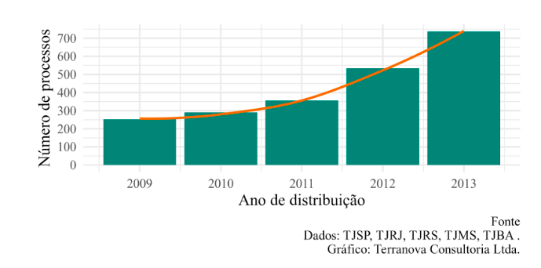
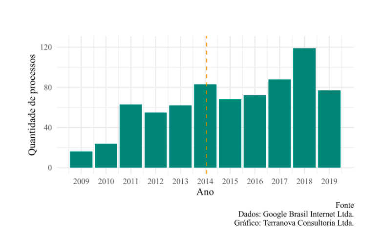
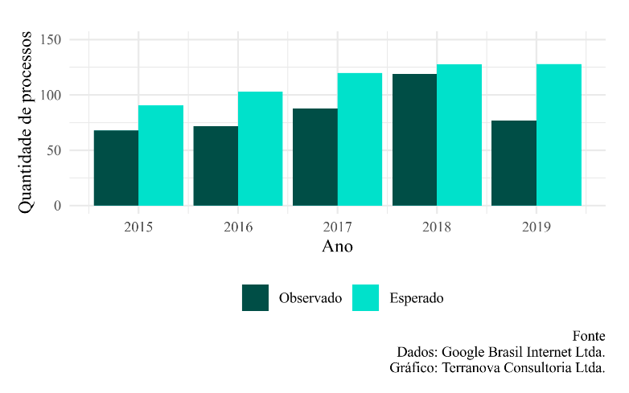
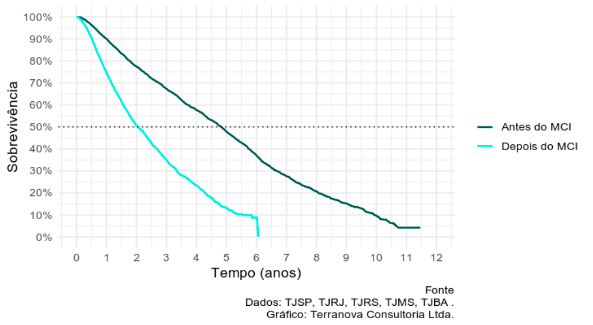
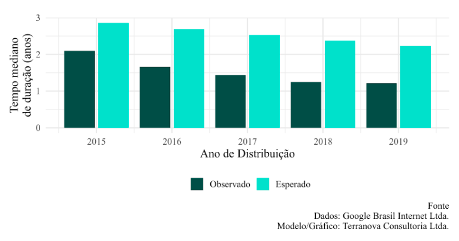
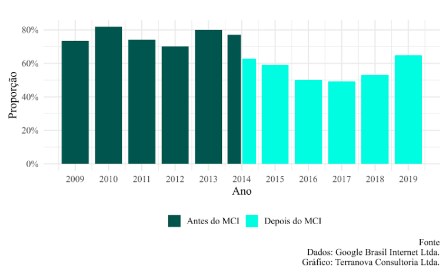
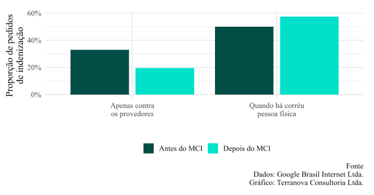
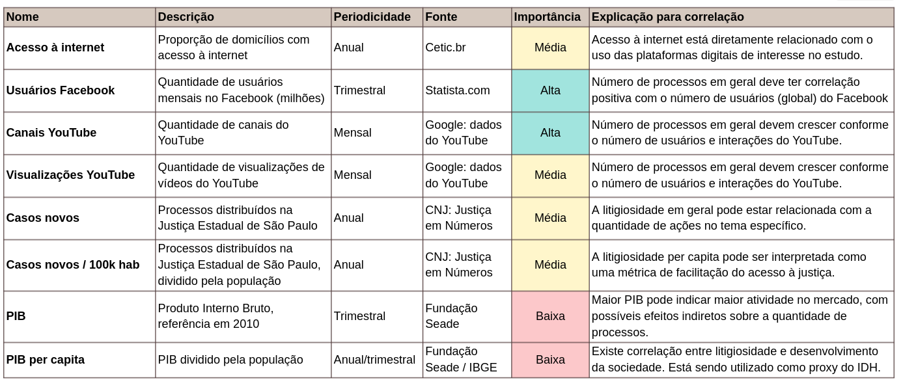
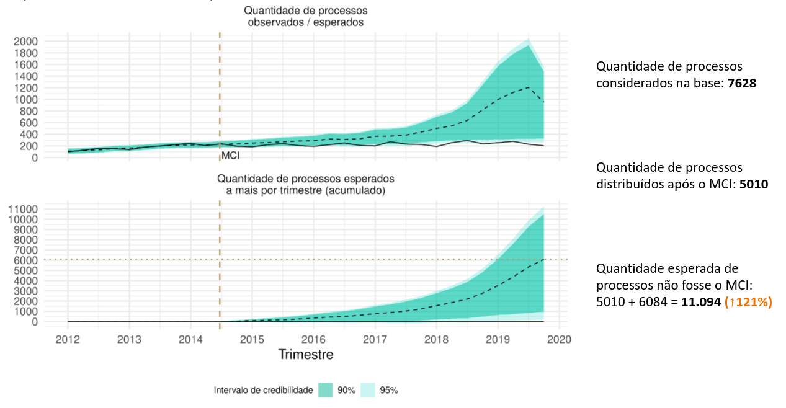

```{r setup, include=FALSE}
knitr::opts_chunk$set(
  echo = FALSE,
  fig.align = "center",
  out.width = "90%",
  message = FALSE,
  warning = FALSE
)

xaringanExtra::use_panelset()
xaringanExtra::use_scribble()
```

```{r meta, echo=FALSE}
library(metathis)
meta() %>%
  meta_general(
    description = "Análise MCI",
    generator = "xaringan and remark.js"
  ) %>% 
  meta_name("github-repo" = "ndtj/main-jurimetria") %>% 
  meta_social(
    title = "Introdução à Jurimetria",
    url = "https://ndtj.github.io/main-jurimetria",
    image = "https://ndtj.com.br/img/logo.png",
    image_alt = "Logo do NDTJ.",
    og_type = "website",
    og_author = "Julio Trecenti",
    twitter_card_type = "summary_large_image",
    twitter_creator = "@jtrecenti"
  )
```


---
class: case

# Resumo

A Lei nº 12.965/2014, denominada __Marco Civil da Internet__ (Marco Civil), estabelece, de acordo com seu próprio texto, "princípios, garantias, direitos e deveres para o uso da Internet no Brasil". 

- Destaca-se especialmente o art. 19, que discorre sobre o regime de responsabilização dos provedores de aplicações por __conteúdo de terceiros__, gerado por seus usuários. 

- O dispositivo segue a lógica de que, como regra, o __autor do conteúdo__ é quem deve responder pelos eventuais danos que causar. 
    - __Provedores__ devem ser responsabilizados se deixarem de cumprir tempestivamente __ordens judiciais__.

---
class: case

# Art. 19 MCI

> Art. 19. Com o intuito de assegurar a liberdade de expressão e impedir a censura, o provedor de aplicações de internet somente poderá ser responsabilizado civilmente por danos decorrentes de conteúdo gerado por terceiros se, após ordem judicial específica, não tomar as providências para, no âmbito e nos limites técnicos do seu serviço e dentro do prazo assinalado, tornar indisponível o conteúdo apontado como infringente, ressalvadas as disposições legais em contrário.

> § 1º A ordem judicial de que trata o caput deverá conter, sob pena de nulidade, identificação clara e específica do conteúdo apontado como infringente, que permita a localização inequívoca do material.

> § 2º A aplicação do disposto neste artigo para infrações a direitos de autor ou a direitos conexos depende de previsão legal específica, que deverá respeitar a liberdade de expressão e demais garantias previstas no art. 5º da Constituição Federal.

> ...

---
class: jurimetrics

# Informações iniciais

- No estudo, encontramos um __crescimento descontrolado__ do número de ações relacionadas à remoção de conteúdo gerado por terceiros antes do MCI.

```{r}

```

- No art. 19, o MCI __pretende mitigar__ este cenário de insegurança ao vincular a responsabilização do provedor com a desobediência a ordem judicial, sem prejuízo de responsabilização civil do autor do material ofensivo.


---
class: jurimetrics

# Método

- Há diversos __fatores externos__ que podem interferir na efetivação dos objetivos do Marco Civil. 

- Dentre esses fatores encontram-se a __expansão da internet__ no Brasil e a introdução do __processo judicial eletrônico__. 

- Utilizamos métodos capazes de __isolar__ os efeitos dos fatores exógenos e apresentar uma visão holística da aplicação prática do Marco Civil.

---
class: jurimetrics

# Dados

- __Dados internos__ disponibilizados pela Google Brasil (ações judiciais propostas contra a Google Brasil por conta de conteúdo disponibilizado na plataforma YouTube, distribuídas no Tribunal de Justiça do Estado de São Paulo).

- __Dados externos__ (públicos) de cinco tribunais estaduais: TJSP, TJRJ, TJRS, TJMS e TJBA

---
class: case, middle, center

# Pergunta principal

### O advento do Marco Civil afetou o volume de demandas judiciais, a pacificação do tema e o perfil das ações de remoção de conteúdo?

---
class: case

# Questões norteadoras

1. O advento do Marco Civil evitou o crescimento desordenado das demandas judiciais relacionadas à remoção de conteúdo? 

1. O advento do Marco Civil reduziu o tempo de duração dos processos judiciais, contribuindo para a satisfação mais célere dos direitos envolvidos?

1. O advento do Marco Civil reduziu a proporção de recursos interpostos?

1. O advento do Marco Civil prejudicou a reparação das vítimas de conteúdo reputado ilícito?

---
class: case

# Conclusões

- O Marco Civil __controlou o volume de demandas__ judiciais sem prejudicar a __liberdade de expressão__ e os demais direitos dos usuários. 

- Ao criar regras claras para resolução desses conflitos, houve maior pacificação do tema, confirmada pelo efeito que o Marco Civil teve no __tempo de duração__ dos processos e na taxa de __recorribilidade__ das demandas.

---
class: case

# Conclusões

Estatísticas gerais: 

- Resultaram em __maior segurança jurídica__: o tempo de duração dos processos foi reduzido em até 45% e que a taxa de recorribilidade das ações caiu de 70/80% para 50/60%.
    
- __Controlaram o volume__ de demandas judiciais: preveniu a judicialização de aproximadamente __seis mil conflitos__ ao longo dos últimos 5 anos nos tribunais mapeados. 

- A desjudicialização não implicou na ausência de tutela jurídica: a quantidade de __remoções extrajudiciais__ realizadas pelos provedores de aplicação aumentou.

- Os __autores__ dos conteúdos estão sendo responsabilizados civilmente pelos danos causados: a proporção de indenização contra os provedores caiu de 33% para 20%, ao passo que subiu de 50% para 58% quando há pessoa física como corréu. 


---
class: case

# Bases de dados

__Base 1__: Dados de processos relacionados ao YouTube
  - Fornecidos pela Google
  
  
__Base 2__: Dados do judiciário
  - Recorte regional: TJSP, TJRJ, TJRS, TJMS, TJBA.
  - Processos distribuídos a partir de 2010
  - Envolvendo diversas empresas (Facebook, Google etc)
  - Tema envolvendo remoção de conteúdo gerado por terceiro

---
class: case

# Volume de processos

```{r}

```

---
class: case

# Volume esperado de processos

```{r}

```

---
class: case

# Tempos

```{r}

```

---
class: case

# Tempo ao longo dos anos

```{r}

```

---
class: case

# Recorribilidade

```{r}

```

---
class: case

# Tipo de ação

```{r}

```

---
class: stats

# Análise contrafactual

__Causalidade__: habilidade de ir além da correlação e estabelecer relações concretas entre as quantidades.

Existem três níveis de causalidade:

- __Predição__: para responder perguntas do tipo "o que?"
- __Intervenção__: para responder perguntas do tipo "como?"
- __Contrafactual__: para responder perguntas do tipo "por que?"

---
class: case

# Variáveis utilizadas

```{r}

```

---
class: case

# Análise contrafactual

```{r}

```

---
class: case

# Visual law

```{r}
magick::image_read_pdf("img/visual-law.pdf")
```

---
class: center, middle, inverse

# Obrigado!

### [Marcelo Guedes Nunes](mailto:mnunes@guedesnunes.com.br)

### [Julio Trecenti](mailto:jaztrecenti@pucsp.br)
